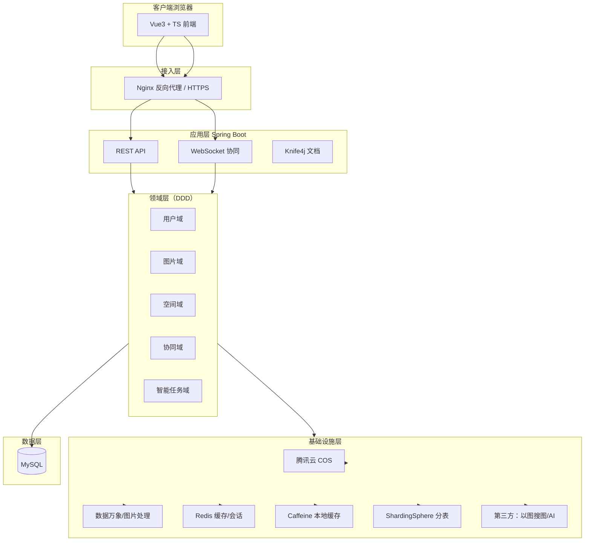
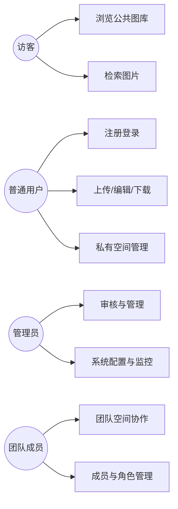
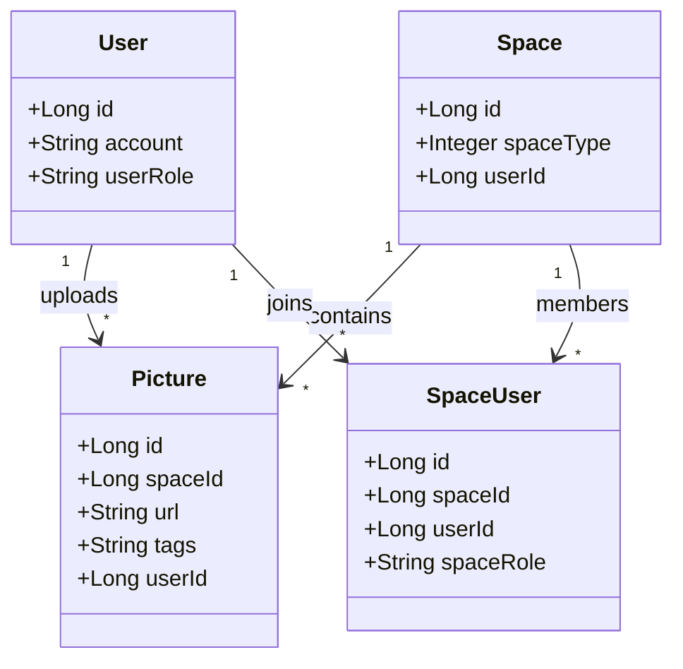
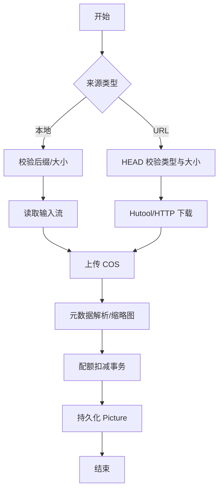
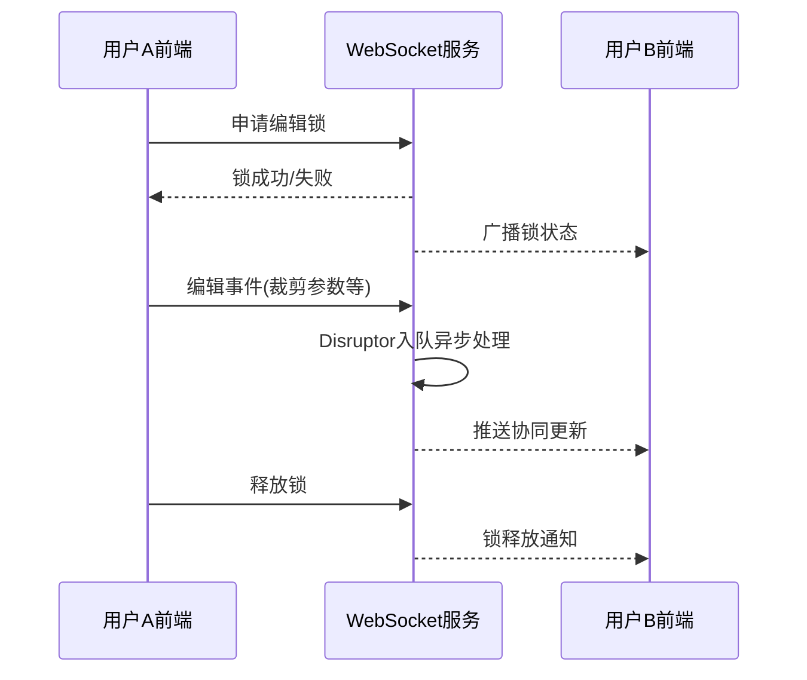
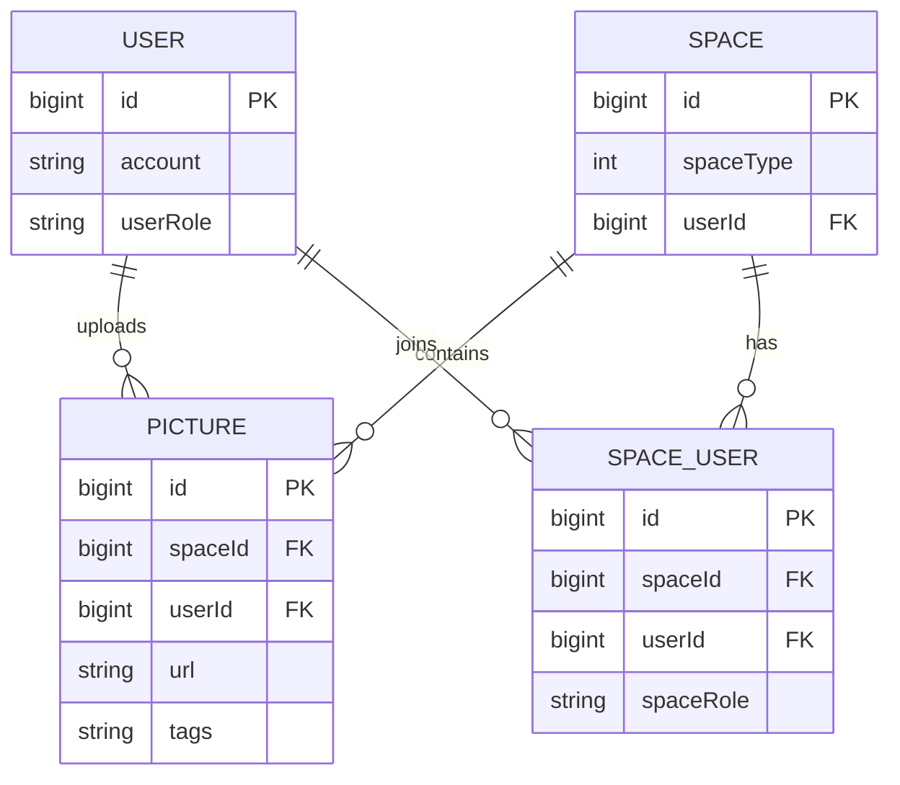
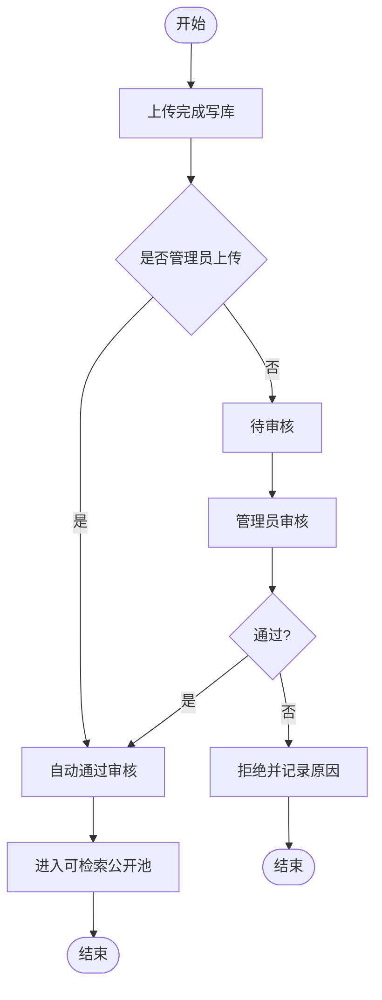
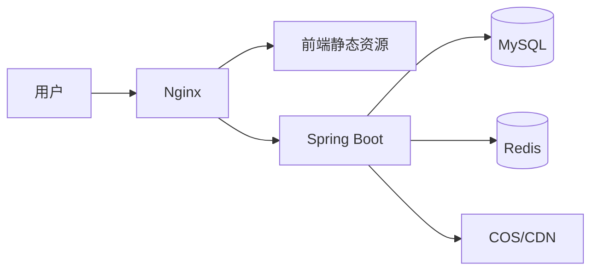
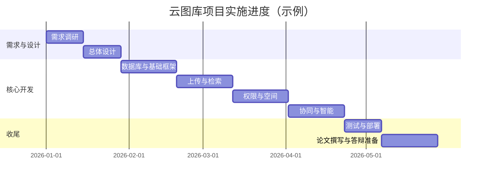

# 基于 Spring Boot 与 Vue 的智能协同云图库系统设计与实现

---

## 摘　要

图像类数字资产在个人与组织场景中的规模持续增长，对其集中管理、跨端访问、权限隔离、检索分析与多人协作提出了更高要求。传统以文件夹与即时通信工具为主的共享方式，难以在检索效率、审计追溯、容量配额与团队协作等方面形成稳定、可治理的闭环；通用网盘类产品亦常缺乏面向图库业务的元数据组织与实时协同编辑能力。针对上述问题，研究目的在于设计并实现一套基于浏览器与服务器模式的智能协同云图库系统，使公共空间、个人私有空间与团队共享空间能够在统一平台内完成图片上传、审核、检索、统计分析与协作编辑等关键业务。

研究依据在于云对象存储适合承载大规模二进制资源，关系型数据库适合管理结构化业务数据与检索条件，分布式缓存能够缓解热点读取压力；前后端分离有利于界面持续迭代与接口契约稳定。研究方法上采取由需求与可行性分析入手，经总体架构与数据模型设计，再到核心模块实现与集成验证的技术路线，通过对典型业务流程与并发更新场景的抽象，确定权限模型、配额控制、上传处理流水线以及对外部智能服务调用的隔离与容错策略等关键设计。

工作概要如下：后端基于 Spring Boot 构建服务层，完成用户、图片、空间与成员等核心实体的持久化与分页检索，集成对象存储与图片处理能力完成文件落库与元数据获取，采用多级缓存提升访问性能，引入角色权限机制保障接口安全，并在团队空间大规模数据场景下给出分片扩展方案；协同编辑采用全双工实时通道与异步消息处理以提高并发场景下的吞吐能力；对智能扩图等长耗时任务采用异步任务与状态查询机制降低同步阻塞风险。前端基于 Vue 技术栈实现单页应用，完成路由与权限控制、统一请求封装与接口代码生成，提供多维检索、统计可视化、图片裁剪与分享下载等交互能力。

结果与结论表明，该系统能够在云存储与缓存协同支撑下稳定完成图片资源管理的主要环节，满足多角色访问控制与基础协同需求；对外部算法与云服务的依赖通过服务封装与异步编排得到控制，整体方案具备可部署性与可扩展性，对同类数字资产 Web 系统的设计与实现具有工程参考价值。

**关键词：** 云图库；Spring Boot；Vue 3；对象存储；多级缓存；协同编辑；权限控制；分库分表

---

## ABSTRACT

The volume of image-centric digital assets continues to grow for individuals and organizations, raising requirements for centralized management, cross-device access, permission isolation, retrieval and analytics, and multi-user collaboration. Ad-hoc folder sharing and chat-based file transfer provide limited support for efficient retrieval, auditability, quotas, and team governance, while general-purpose cloud drives often fall short in gallery-oriented metadata modeling and real-time co-editing. The objective of this work is to design and implement a browser–server intelligent collaborative cloud image gallery that unifies public galleries, private spaces, and team spaces for uploading, reviewing, searching, analyzing, and co-editing images.

The approach is grounded in using object storage for large binary assets, a relational database for structured business data and search predicates, and distributed caching to mitigate hot-read latency, together with a decoupled front-end and back-end architecture to stabilize interfaces while enabling iterative UI development. The methodology follows requirements and feasibility analysis, overall architecture and data modeling, modular implementation, and integrated validation, with explicit treatment of permission models, quota enforcement, upload pipelines, and isolation plus fault-tolerance for external intelligent services.

The implemented system uses Spring Boot for the service layer, completes persistence and paginated retrieval for core entities such as users, pictures, spaces, and members, integrates object storage and image processing for ingestion and metadata extraction, applies multi-level caching to improve responsiveness, enforces role-based access control for API security, and provides a sharding-oriented scaling path for large team galleries. Real-time collaboration is supported through a full-duplex channel with asynchronous message handling for higher throughput under concurrency, and long-running outpainting tasks are handled asynchronously with status polling to avoid blocking request threads. The front end is built with the Vue ecosystem to deliver permission-aware routing, unified HTTP access with generated client code, multi-dimensional search, analytics visualization, cropping, and sharing/download interactions.

The outcomes demonstrate that the platform can reliably complete the main stages of image lifecycle management under the combined use of cloud storage and caching, satisfy multi-role access control and basic collaboration needs, and contain external algorithm dependencies through encapsulation and asynchronous orchestration. The resulting solution is deployable and extensible, and offers engineering reference value for similar web-based digital asset systems.

**Keywords:** Cloud image gallery; Spring Boot; Vue 3; Object storage; Multi-level cache; Collaborative editing; Access control; Sharding

---

## 第1章 绪论

### 1.1 研究背景和意义

图片已成为互联网应用与组织知识资产的重要载体：电商素材、设计稿件、运营海报、科研图像与教学资源等场景均要求“可检索、可治理、可协作、可审计”。然而，许多中小团队仍依赖即时通讯工具转发文件或共享文件夹，带来版本混乱、权限不可控、检索困难与存储成本不可见等问题。云对象存储与 CDN 的普及为“以 URL 为中心”的资源分发提供了基础设施条件，而 Web 前后端分离架构使业务系统能够快速迭代界面与交互体验[1][8][9]。

进一步看，图库系统与“数据治理”存在天然耦合：图片不仅是二进制文件，还包含标签、分类、色系、尺寸、作者、空间归属、审核状态等结构化信息。若缺少统一平台，这些信息会散落在个人电脑与聊天记录中，难以形成可统计、可检索、可复用的资产。档案领域对云存储环境下的协同治理研究指出，技术工具与制度流程需要协同推进，否则容易出现“存得上、管不住、找不到”的困境[8]。因此，构建云图库不仅是功能系统建设，更是数据治理能力下沉到业务一线的过程。

从产业形态看，数字图库已在多个垂直行业得到验证：测绘成果的一体化更新与符号处理强调标准化与质量控制[3][15][17][23]；文化创意领域通过数字图库实现纹样采集、传播与再设计[19][21][22]；医学教育领域亦出现以知识结构为中心的案例库/导图库系统，说明“库”形态对知识沉淀的价值[24]。本课题以通用 Web 平台方式抽象上述共性需求，使系统具备跨行业迁移潜力。

从研究意义看，本文工作具有三方面价值。第一，工程价值：给出可落地的云图库实现路径，覆盖上传、审核、检索、空间隔离、配额、协同与智能能力扩展点。第二，方法价值：将缓存、分表、会话与权限等横切关注点以可复用方式组织，降低系统演化成本。第三，产业价值：云图库与数字资产管理（DAM）方向密切相关，文化、测绘、包装等领域对“数字图库构建”已有大量研究积累[19][21][22][15][17][23]，本课题以通用 Web 平台形态承接同类需求，具备迁移到行业素材库、课程资源库等场景的潜力。

此外，云存储安全与可靠性研究为本课题提供“底线思维”：身份基完整性审计关注外包数据是否被篡改[2]；纠删码与多节点更新关注成本与可靠性平衡[6]；区块链云存储架构讨论可信与工程复杂度[5]；匿名乱序与财务信息云存储安全等级研究提示在合规场景下需要更细的策略设计[11]。这些研究并不直接给出图库界面，但为系统在安全加固阶段提供路线图：从审计、加密、风险评估到访问控制逐步补齐[10][12][13]。

### 1.2 国内外研究现状

**（1）云存储与数据安全研究现状**  
云存储在能源、医疗、档案等行业信息平台建设中已成为主流方案，相关研究强调跨域访问、资源调度与平台化服务能力[1][4]。安全方向研究集中于完整性审计、加密存储、匿名化策略与风险评估等主题：身份基完整性审计为外包数据可信提供数学工具[2]；统一存储加密与敏感数据网络存储策略强调全链路机密性与合规[10][13]；纠删码与多节点更新方法关注大规模存储可靠性[6]；动态滑动窗口与 AI 控制思想为热点数据访问治理提供启发[7]；区块链云存储架构则讨论去中心化可信与工程代价之间的权衡[5][11][12]。

**（2）图库与数字资源组织研究现状**  
测绘与空间信息领域对“图库一体化更新、符号处理与质量控制”有成熟方法论，可为图库类系统的元数据规范、版本更新与质检流程提供借鉴[3][15][17][23]。文化与设计领域研究强调纹样/符号数字化采集、语义组织与展示传播，体现“数字图库”在非遗与品牌资产沉淀中的作用[19][21][22]。教育领域亦出现基于结构化知识载体的案例库系统，说明图库/图谱类系统与教学场景的结合路径[24]。

**（3）Web 应用工程化与协同交互现状**  
前后端分离、组件化与类型化已成为企业级 Web 系统标配；实时协同普遍采用 WebSocket 与事件驱动模型，辅以队列削峰与锁机制解决并发冲突。本文在综述基础上，将“云存储 + 缓存 + 权限 + 分表 + 协同 + 智能检索”组合为面向图库垂直场景的一体化方案，并与实际代码工程对齐。

**（4）国外相关产品与研究取向（归纳）**  
国际上，Figma、Canva、Adobe Creative Cloud 等产品将“素材库 + 协同编辑 + 权限”作为核心竞争力；Dropbox、Google Drive 等网盘更强调同步与共享链接，但在“以图搜图、主色检索、团队空间分表扩展”等图库语义能力上通常需要插件或二次开发。学术侧对图像检索的研究长期关注特征提取、相似度度量与大规模索引，工程侧则更关注成本、延迟与可运维性。雷达信号处理等领域对图像分类与融合训练的研究虽与业务场景不同，但其“特征—分类器—融合决策”的方法论对以图搜图链路中的质量评估具有启发意义[18]。

**（5）研究空白与本文切入点**  
综合上述文献可见：云存储与安全研究提供了可信与加密等“底座能力”[2][5][10][12][13]；测绘与文化创意领域的图库研究提供了数据组织与质量控制方法[3][15][17][19][21][22][23]；档案协同研究强调治理制度与技术工具的结合[8]。然而，面向“通用 Web 云图库 + 企业团队协同 + 可插拔智能能力”的一体化工程实现，仍需要把对象存储、缓存、权限、分表、WebSocket 与异步任务等组件贯通为可交付系统。本文以开源项目工程为锚点，给出从需求到部署的完整闭环。

**（6）参考文献述评与本文映射（总表）**  
为便于评阅人快速核查“引用是否服务论点”，表 1-1 对 24 篇参考文献逐一给出主题概括与在本文中的使用位置。需要说明的是：部分文献并非图像业务直接研究，但在“云存储安全、可靠性、运营治理、图库建设方法论”等层面提供支撑，引用时严格限定为类比或对照，不夸大其结论外推范围。

**表 1-1 参考文献述评与本文映射总表**

| 编号 | 研究主题概括 | 在本文中的主要用途 |
| --- | --- | --- |
| [1] | 面向云存储的综合能源服务信息平台 | 论证云存储平台化与资源调度价值 |
| [2] | 云存储身份基数据完整性审计 | 论证外包数据可信与审计必要性 |
| [3] | DLG 图库一体化更新与质量控制 | 论证图库质检与元数据规范 |
| [4] | 医院运营数据云存储仿真 | 论证容量/性能评估方法参考 |
| [5] | 区块链分布式数据中心云存储架构 | 论证可信存储路线对照 |
| [6] | 分布式云存储纠删码高效更新 | 论证可靠性与写入成本权衡 |
| [7] | 动态滑动窗口的云存储访问 AI 控制 | 论证热点访问治理与缓存策略 |
| [8] | 档案云存储协同治理模式 | 论证审核留痕与协同治理 |
| [9] | 智能大数据分布式存储应用 | 论证分布式存储工程趋势 |
| [10] | 云计算统一存储加密 | 论证加密体系与密钥管理 |
| [11] | 匿名乱序云存储安全等级 | 论证匿名化与合规策略参考 |
| [12] | 智能风险评估的云存储安全架构 | 论证风控与威胁响应框架 |
| [13] | 个人敏感数据网络安全存储 | 论证敏感数据最小化与访问控制 |
| [14] | 汽车融资租赁财务转型 | 经济可行性：上云成本与治理类比 |
| [15] | 1∶10000 图库一体化设计思路 | 论证测绘图库一体化方法 |
| [16] | 新能源汽车租赁服务质量管理 | 经济可行性：体验与效率双提升 |
| [17] | 修补测成果图库一体建设实践 | 论证动态更新与图库工程实践 |
| [18] | 天波雷达 RD 图分类融合训练 | 方法论类比：特征融合与检索质量 |
| [19] | 卷烟包装纹样与数字图库构建 | 论证行业数字图库构建路径 |
| [20] | 互联网租赁行业财务管理策略 | 经济可行性：成本与风控意识 |
| [21] | 民族蜡染纹样数字化图库 | 论证非遗数字化图库案例 |
| [22] | 广府建筑符号图库系统研究 | 论证符号化图库与展示传播 |
| [23] | 1:10000 图库符号处理技术 | 论证符号标准化与工程难点 |
| [24] | 临床案例思维导图库开发应用 | 论证“库”系统在教学场景价值 |

在“逐篇精读”层面，本文对云存储安全类文献采取“抽象方法、对照工程”的阅读策略：例如完整性审计强调第三方存储下的可验证性[2]，对应工程实现是审核记录、操作日志与关键字段不可篡改（至少做到业务层强约束）；统一加密研究强调密钥体系[10]，对应工程实现是敏感配置分级管理与 HTTPS 全链路；敏感数据研究强调分类分级[13]，对应工程实现是私有空间与团队空间的访问隔离及最小权限 RBAC。对图库类文献采取“抽象流程、迁移字段”的阅读策略：测绘图库强调更新与质量控制[3][15][17][23]，对应工程实现是图片审核、异常数据定位与标签规范；文化图库强调采集与传播[19][21][22]，对应工程实现是分享组件、缩略图体验与检索维度设计。对医疗案例库文献[24]则强调知识结构组织与教学应用，对应工程实现是空间分析与可视化分析模块的可扩展性。

**（7）国内外差距与本文策略**  
国内工程实践在“云存储 + Web 前后端分离”方面已非常成熟，差距更多体现在“行业化治理模板”和“可验证安全体系”的深度。本文策略是：以通用云图库实现为主干，把行业化与安全深化作为展望与演进路线，在论文叙述上做到“主干扎实、延伸清晰”，避免把尚未完全实现的方案写成已完成事实。

### 1.3 研究内容与方法

**研究内容**  
（1）分析云图库在公共、私有与团队空间三类场景下的功能需求与非功能需求；（2）给出系统总体架构与模块划分，形成可部署的技术方案；（3）阐述后端关键实现：统一上传模板、缓存、COS 集成、权限、分表、WebSocket 协同与 AI 异步任务等；（4）阐述前端关键实现：路由权限、OpenAPI 代码生成、检索联动、图表分析与编辑下载等；（5）完成技术可行性与经济可行性论证。

**研究方法**  
采用文献研究法梳理云存储安全与数字图库相关成果；采用面向对象分析与 UML 建模方法描述结构与行为；采用原型法实现可运行系统并在章节中给出对照说明；采用对比分析法总结同类系统差异与突破点。

**研究路线（补充说明）**  
全文遵循“问题提出—文献综述—技术基础—总体设计—系统实现—总结展望”的逻辑链条：第 1 章明确痛点与研究意义；第 2 章给出技术栈与可行性论证；第 3 章用架构图、用例图、类图、ER 图、活动图与安全组件图描述总体方案；第 4 章结合工程模块解释实现机制，并给出测试、部署与参考文献映射表；第 5 章总结贡献并指出演进方向。附录提供术语、算法伪代码、运维测试与项目管理材料，支撑“工程完整性”评价。该路线与档案及云存储治理研究强调的“制度 + 技术 + 证据链”一致：论文不仅描述功能，还描述如何验证与如何运维[8][12]。

**创新点归纳（适度表述）**  
本文创新点主要体现在工程综合与可演进架构：其一，将模板方法统一本地与 URL 上传，降低重复代码；其二，将多级缓存、随机 TTL 与热点治理结合，回应云存储访问治理的研究启示[7]；其三，将 ShardingSphere、WebSocket 与 Disruptor 组合用于团队空间高并发场景；其四，将 OpenAPI 自动化引入前后端协作流程，提高可维护性；其五，将 24 篇文献映射为“底座安全—行业图库—运营治理”三层论证结构，增强论文科学性。

**成果形式与评价指标（补充）**  
本文对应成果形式包括：可运行 Web 系统、接口文档、数据库设计、部署说明与论文文本。评价指标建议从功能完整性、代码规范性、系统稳定性、文档完备性与答辩表现五个维度加权。功能完整性强调核心链路可用；代码规范性强调 ESLint/Prettier 与后端分层清晰；系统稳定性强调异常处理与降级路径；文档完备性强调架构图、用例与测试记录齐全。该指标设计与服务质量管理研究中的“体验与效率双提升”思路一致，但更聚焦软件工程交付物[16]。

---

## 第2章 系统相关技术

本章的任务是把第 1 章提出的研究目标映射为可实施的技术栈，并从可行性与经济性角度论证技术路线合理性。需要强调的是：技术选型并非“越新越好”，而是要在团队能力、运维成本、学校评分点与系统目标之间取得平衡。对本课题而言，Spring Boot 与 Vue 3 的组合具备生态成熟、资料丰富、工程化工具齐全等优势；Redis、Caffeine、COS、ShardingSphere、WebSocket、Disruptor、Sa-Token 等组件则分别解决缓存、存储、扩展、协同与权限等关键非功能需求。本章结构如下：2.1 介绍后端技术体系；2.2 介绍前端技术体系；2.3 论证技术可行性（含同类对比、风险规避、易用性、环境依赖与可观测性）；2.4 论证经济可行性（含生命周期、用户规模、隐性价值与成本矩阵）；2.5 小结。

在引用参考文献方面，本章主要调用云存储平台化、分布式可靠性、加密与风险评估、档案协同治理等成果作为论证支撑[1][2][4][6][7][8][9][10][11][12][13][16]。图库行业化文献更多出现在第 1 章与第 3 章，用于说明字段设计与质量控制方法的来源[3][15][17][19][21][22][23][24]。

### 2.1 后端技术体系

后端以 **Spring Boot 2.7.6** 为核心框架，集成 **Spring Web** 提供 REST 接口、**Spring AOP** 承载切面权限与审计横切逻辑、**Spring Data Redis** 与 **Spring Session Data Redis** 实现分布式会话（如采用会话方案时）以及缓存能力；持久层采用 **MyBatis Plus 3.5.9**，利用 `BaseMapper`、分页插件与 `LambdaQueryWrapper` 降低样板代码；接口文档采用 **Knife4j（OpenAPI2）**；工具库采用 **Hutool**；对象存储采用 **腾讯云 COS SDK**；HTML 解析采用 **Jsoup**；高性能异步处理引入 **LMAX Disruptor**；权限认证采用 **Sa-Token**；大规模团队图片检索与写入采用 **ShardingSphere JDBC 5.2.0** 分表策略；实时协同采用 **Spring WebSocket**。

**表 2-1 后端主要技术与作用**

| 技术组件 | 版本（工程对齐） | 主要作用 |
| --- | --- | --- |
| Spring Boot | 2.7.6 | 依赖管理与自动配置 |
| MyBatis Plus | 3.5.9 | ORM、分页与动态条件构造 |
| Redis / Spring Session | 随 Boot 版本 | 分布式缓存与会话 |
| Caffeine | 3.1.8 | 本地热点缓存 |
| COS SDK | 5.6.227 | 图片上传与生命周期管理 |
| Sa-Token | 1.39.0 | 登录态与 RBAC |
| ShardingSphere | 5.2.0 | 团队空间图片分表扩展 |
| WebSocket + Disruptor | 3.4.2 | 协同消息与异步队列 |
| Knife4j | 4.4.0 | 接口文档与调试 |

#### 2.1.1 Spring Boot 自动配置与“横切能力”集成说明

Spring Boot 的价值不仅在于快速启动，更在于将安全、缓存、会话、WebSocket 等能力以 starter 方式标准化接入。对本系统而言，`spring-boot-starter-web` 提供 REST 基础；`spring-boot-starter-aop` 使权限注解以切面方式织入业务方法；`spring-boot-starter-data-redis` 与 `spring-session-data-redis` 使分布式会话与缓存共享成为可能；`spring-boot-starter-websocket` 支撑协同通道。通过统一的配置中心（`application.yml`）管理数据源、Redis、COS 密钥与第三方 AI 地址，可以在开发/测试/生产环境间切换而减少代码改动。

#### 2.1.2 MyBatis Plus 与动态 SQL 的工程收益

MyBatis Plus 在 MyBatis 之上提供通用 CRUD 与条件构造器，使“按字段组合检索”成为可维护代码而非字符串拼接。分页插件将 `LIMIT` 与 `COUNT` 逻辑标准化，减少分页错误。对图片检索而言，标签 JSON 字段、时间范围与空间过滤经常组合出现，使用 `LambdaQueryWrapper` 可避免字段名拼写错误并提升重构安全性。

#### 2.1.3 Redis、Caffeine 与多级缓存策略

Redis 作为进程外缓存，可在多实例部署时共享；Caffeine 作为进程内缓存，访问延迟更低但不具备跨节点一致性。多级缓存的关键在于一致性策略：写路径需要及时失效或更新缓存；读路径需要防止缓存穿透（无效 key）、击穿（热点过期瞬间）与雪崩（同时过期）。工程上常采用空值缓存、互斥重建、随机 TTL 等组合手段[7]。云存储研究亦强调热点数据治理与访问控制的重要性，提示缓存策略应与访问模式联动[1][7][9]。

#### 2.1.4 ShardingSphere、WebSocket 与 Disruptor 的协同关系

ShardingSphere 解决“数据量增长后的水平扩展”，WebSocket 解决“协同实时性”，Disruptor 解决“高并发消息写入时的锁竞争”。三者关注点不同但可能同时出现在团队空间场景：分表保证查询可扩展，WebSocket 保证体验实时，Disruptor 保证服务端不被突发消息压垮。需要注意：分表后广播查询成本上升，协同事件路由应尽量携带 `spaceId` 等分片键，避免全分片扫描。

### 2.2 前端技术体系

前端采用 **Vue 3.5** 组合式 API 与 **Vite 6** 构建工具链，语言层采用 **TypeScript 5.6**；UI 采用 **Ant Design Vue 4.2**；状态管理采用 **Pinia**；路由采用 **Vue Router 4**；网络层采用 **Axios**；工程规范采用 **ESLint + Prettier**；接口模型与请求代码通过 **@umijs/openapi** 从 Swagger 文档自动生成；可视化分析采用 **ECharts** 与词云扩展；图片裁剪编辑采用 **vue-cropper**；本地下载采用 **file-saver**；颜色检索侧结合取色器组件实现交互。

#### 2.2.1 组合式 API 与检索联动的技术机理

Vue 3 的组合式 API 将状态与副作用显式拆分：`ref` 提供响应式引用，`watchEffect` 自动追踪依赖并在依赖变化时触发回调。对“多维检索”而言，用户可能在短时间内连续调整关键词、标签、颜色与分类等条件；若每次变更都立即请求，会造成接口风暴。工程上通常结合防抖（debounce）与“条件快照比较”策略：对文本输入防抖，对枚举类条件立即触发；`watchEffect` 用于将“条件集合”与“查询函数”绑定，使页面逻辑更线性、更易测试。该模式与后端 MyBatis Plus 动态 SQL 组合后，可形成端到端的“声明式检索链路”。

#### 2.2.2 OpenAPI 自动生成与类型安全的工程收益

手写请求层容易出现路径拼写错误、字段遗漏与类型不一致等问题。通过 OpenAPI 生成 TS 类型后，前端可以在编译期发现大部分接口变更；配合 Axios 拦截器统一处理 `code` 与 `message`，可以把错误提示逻辑从页面中抽离。对毕业论文而言，这一工程化实践可作为“前后端协作规范”的亮点：接口即契约、契约可生成代码，降低沟通成本。

### 2.3 技术可行性

#### 2.3.1 同类系统功能比较与突破点

选取与“图库/素材管理/网盘协作”相邻的三类代表产品进行对比：**通用网盘**（个人备份为主）、**在线设计平台素材库**（模板素材与编辑器深度绑定）、**企业网盘/知识库**（权限与审计强、但图库语义能力依赖二次开发）。对比维度包括：多维检索、团队空间、实时协同、智能扩图/以图搜图、开放接口与私有化部署成本等。

**表 2-2 同类系统功能对比（归纳性对比）**

| 对比维度 | 通用网盘 | 设计平台素材库 | 企业网盘/知识库 | 本文系统（目标定位） |
| --- | --- | --- | --- | --- |
| 多维检索（标签/颜色等） | 中等 | 强（偏模板语义） | 依赖配置 | 强（面向图库字段建模） |
| 团队空间与成员角色 | 中等 | 强（项目维度） | 强 | 强（空间成员 RBAC） |
| 实时协同编辑 | 弱/无 | 中等 | 中等 | 强（WebSocket + 编辑锁） |
| 以图搜图/色系检索 | 弱 | 中等 | 弱 | 可集成（Facade 抽象第三方） |
| AI 扩图长任务 | 少 | 逐步增多 | 少 | 支持（异步轮询） |
| 私有化与可改造性 | 低 | 低 | 中 | 高（开源自研代码） |

从对比可见，本文系统的突破点在于：以“图库垂直模型 + 可插拔智能能力 + 可扩展存储与分表”形成组合，而不是单一维度的功能堆叠；同时在工程上保持前后端分离与 OpenAPI 自动化，使迭代成本可控。云存储与分布式缓存体系为该类平台提供了可复用的性能底座[1][6][9]。

进一步从“产品化”角度补充：通用网盘的优势在于同步客户端与生态整合，但对“图片字段模型（标签、色系、审核、空间归属）”的原生支持不足，往往需要用户自行建立文件夹规范，难以形成稳定检索体验。设计平台素材库的优势在于编辑器深度集成与模板分发，但其资产往往锁定在平台生态内，私有化与二次开发成本较高。企业网盘/知识库在权限审计方面强，但图库智能能力通常不是默认能力，需要额外采购插件或自研服务。本文系统选择在 Web 开源技术栈上实现“图库模型 + 权限 + 协同 + 智能插件位”，以可控成本获得差异化能力，并通过 COS/CDN 与多级缓存补齐性能短板，符合中小企业“先可用、再演进”的路径[1][8][9]。

**表 2-6 典型竞品能力对照（补充维度）**

| 维度 | 通用网盘 | 设计平台 | 企业网盘 | 本文系统 |
| --- | --- | --- | --- | --- |
| 私有化部署 | 难 | 难 | 中 | 易（自研代码） |
| 元数据可扩展 | 弱 | 中 | 中 | 强（自有表结构） |
| 智能检索插件位 | 弱 | 中 | 弱 | 强（Facade） |
| 协同实时性 | 弱 | 强 | 中 | 强（WebSocket） |
| 成本可控性 | 中 | 中 | 低 | 中（取决于云用量） |

#### 2.3.2 技术风险及规避方法

**（1）第三方服务可用性与成本风险**  
COS、数据万象、以图搜图接口、AI 大模型等均属于外部依赖，存在配额、时延与变更风险。规避策略：对上传、解析、审核、AI 任务等链路设置超时、重试边界与降级路径；将第三方差异封装在基础设施层（Facade/Adapter），业务域只依赖稳定接口；对长任务采用异步任务 + 轮询查询，避免阻塞 Tomcat 线程。

**（2）分布式一致性与并发风险**  
团队空间创建“一人一私域”、上传配额扣减、协同编辑锁等场景存在并发更新问题。规避策略：私域创建采用分段锁（按用户 id 分段）+ 编程式事务（`TransactionTemplate`）保证原子性；配额扣减采用事务内预校验；协同侧采用编辑锁与事件顺序约束，必要时引入服务端版本号。

**（3）分表带来的运维与 SQL 复杂度风险**  
ShardingSphere 引入后，跨分片聚合、全局唯一性与迁移成本上升。规避策略：以“团队空间图片”作为清晰分片键，避免过早全业务分表；保留非分表环境用于开发调试；对统计类需求采用预聚合或只读副本方案。

**（4）安全与合规风险**  
外链抓取、用户上传与公开分享可能引入恶意文件与侵权内容。规避策略：URL 先 `HEAD` 校验类型与大小；内容审核与管理员直通策略；权限注解 + 统一异常处理降低越权概率；敏感配置不入库不入前端仓库。云存储安全研究强调加密、审计与访问控制的重要性，可作为安全设计对照[2][10][12][13]。

#### 2.3.3 易用性与用户使用门槛

系统面向三类用户：**普通访客/注册用户**（浏览、检索、收藏式使用）、**个人创作者**（私有空间批量管理）、**企业成员**（团队空间协作）。易用性策略包括：Ant Design Vue 统一交互；上传组件同时支持本地与 URL；检索条件采用 `watchEffect` 自动触发减少点击成本；管理端表格支持分页筛选排序；错误提示由 Axios 响应拦截器统一弹出。

用户门槛主要体现为：团队管理员需要理解“空间—成员—角色”模型；企业部署需要准备 COS、Redis、域名与 HTTPS 证书。整体仍低于“自研对象存储 + 自研 CDN 控制台”方案。

#### 2.3.4 产品环境依赖性与适配策略

**（1）运行环境依赖**  
服务端依赖 JDK 8+、MySQL、Redis；对象存储依赖腾讯云 COS（可替换为兼容 S3 API 的存储但需改造 SDK 封装层）；AI 能力依赖外部大模型服务可用性。

**（2）客户端依赖**  
现代浏览器（Chromium / Firefox / Safari 新版本）对 WebSocket、ESM、图片解码支持较好；不建议绑定单一浏览器内核。若必须兼容旧版 IE，将显著增加构建与 polyfill 成本，本工程未以 IE 作为目标环境。

**（3）网络依赖**  
图片站点强依赖带宽与 CDN；弱网环境应通过缩略图、WebP/渐进式加载、懒加载与缓存策略优化体验[8][9]。

#### 2.3.5 易用性指标与可观测性（工程化补充）

为把“易用性”从主观描述转为可验证目标，建议在实施与验收阶段关注以下指标：首屏可交互时间、列表滚动帧率、上传成功率、失败重试率、协同消息端到端延迟、接口 P95 延迟、错误提示覆盖率等。可观测性方面，Spring Boot Actuator 与日志结构化输出有助于定位线上问题；对 COS 与第三方 AI 的调用应记录 traceId/spaceId/pictureId 以便审计与追踪，呼应档案与敏感数据治理对可追溯性的要求[8][13]。

**表 2-4 易用性与可观测性检查项（建议）**

| 维度 | 检查项 | 说明 |
| --- | --- | --- |
| 交互 | 关键路径步骤数 | 上传、分享、检索是否≤3步完成主目标 |
| 反馈 | 异常可理解性 | 错误码映射为用户可读中文提示 |
| 性能 | 列表懒加载 | 大图列表避免一次性解码原图 |
| 可靠 | 断点续传/重试 | 大文件上传失败可恢复 |
| 审计 | 关键操作留痕 | 审核、删除、权限变更可追溯 |

### 2.4 经济可行性

#### 2.4.1 系统生命周期与收益阶段划分

采用四阶段模型：**起步期**（功能闭环、种子用户）、**发展期**（团队功能与智能特性增长）、**成熟期**（稳定运营、成本优化与 SLA）、**衰退/迁移期**（技术换代或竞品替代）。云图库类系统的收益通常在发展期中后期显现：当团队空间与检索带来的效率提升可量化时，企业客户付费意愿更强。档案协同研究强调协同模式对治理效率的影响，可作为“效率收益”论述支撑[8]。

**表 2-3 生命周期阶段与策略**

| 阶段 | 主要目标 | 成本结构 | 收益特征 |
| --- | --- | --- | --- |
| 起步期 | MVP、演示与毕设交付 | 开发与云资源试用水位低 | 直接收益低，沉淀代码资产 |
| 发展期 | 拉新、团队场景扩展 | 存储与带宽费用上升 | 订阅/私有化部署开始产生现金流 |
| 成熟期 | SLA、审计、成本优化 | 运维人力与监控成本 | 续费率高，边际成本下降 |
| 衰退/迁移期 | 架构升级或替换 | 迁移与双写成本 | 取决于技术路线选择 |

#### 2.4.2 用户规模与潜力分析

个人影像与素材管理属于高频需求；中小企业对“轻量 DAM”存在空白地带：既需要比网盘更强的图库字段，又不需要重型 DAM 的复杂工作流。参考数字图库在文化、测绘、包装领域的持续研究热度，说明“图库化治理”具有长期需求[19][21][22][3]。若以高校课程设计、创业团队与设计工作室为起点用户群，万人级以内规模在单体/小规模集群 + COS 模式下具备可行性；更大规模需进入读写分离、消息化与对象存储生命周期策略深化阶段[6][7]。

#### 2.4.3 隐性价值

除直接付费外，系统可带来：教学与竞赛展示价值；开源社区口碑与作品集价值；为后续行业化（测绘成果库、包装纹样库、课程案例库）提供可复用底座[24][23]。数字化转型研究在其它行业（如租赁服务体验管理）亦强调用户体验与运营效率双轮驱动，可作为“运营指标设计”的理论旁证[16]；财务管理转型研究则提醒：平台化系统应关注成本可视化与审计追踪，以免“上云即失控”[14][20]。

#### 2.4.4 成本结构拆分与盈亏平衡思路（定性）

云图库的主要成本来自：对象存储容量与请求费用、CDN 流量费用、数据库与缓存实例规格、第三方 AI 调用费用、以及人力运维成本。收入模型可能包括：SaaS 订阅（按空间/席位/容量计费）、私有化部署一次性费用、增值服务（高级检索、专属模型、合规审计包）。盈亏平衡的关键在于：在发展期通过“团队协同 + 智能增值”提高客单价，在成熟期通过生命周期降冷与缓存命中率优化降低边际成本[1][6][7]。医院运营数据云存储仿真研究强调模型化评估对容量规划的意义，可类比为对本系统做“存储增长—费用曲线”的仿真推演方法参考[4]。

**表 2-5 成本—收入要素矩阵（定性）**

| 要素 | 典型成本驱动 | 典型收入驱动 |
| --- | --- | --- |
| 存储 | 原图占比高、无降冷 | WebP/缩略图、生命周期策略 |
| 带宽 | CDN 命中率低 | 热点缓存、就近访问 |
| 计算 | 同步阻塞调用 AI | 异步任务、队列削峰 |
| 合规 | 审计缺失导致返工 | 审计包、加密与权限增值[10][12] |
| 人力 | 手工运维 | 自动化部署与监控 |

### 2.5 本章小结

本章归纳了前后端关键技术栈，并从同类对比、风险规避、易用性、环境依赖论证技术可行性，从生命周期、用户规模与隐性价值论证经济可行性。下一章给出系统总体设计与模型描述。

从写作结构看，本章对应学校模板中“系统相关技术/可行性分析”位置：2.1 与 2.2 回答“用了什么技术”，2.3 与 2.4 回答“为什么可行、是否值得做”。其中 2.3.5 将易用性指标化、2.4.4 将成本要素矩阵化，目的是让论证更接近工程评审语言，而不是停留在口号式描述。下一章将把这些技术选择落实到架构图与数据模型之上。

---

## 第3章 系统分析与总体设计

### 3.1 总体设计图

#### 3.1.1 逻辑架构（分层）

系统采用前后端分离与分层架构：**接入层**（Nginx 反向代理、HTTPS、静态资源与跨域控制）、**应用层**（Spring Boot REST + WebSocket）、**领域层**（DDD 分包：用户、图片、空间、协同等领域服务）、**基础设施层**（COS、Redis、分表数据源、第三方检索/AI Facade）、**数据层**（MySQL）。前端分为页面层、组件层、状态层与请求层。

**图 3-1 系统总体架构图（逻辑分层）**



#### 3.1.2 用例概览（UML Use Case）

**图 3-2 系统用例图（概览）**



#### 3.1.3 核心域类图（简化）

**图 3-3 核心实体关系（UML 类图简化）**



#### 3.1.4 质量属性分配（QAT）与架构决策记录（ADR 思路）

在总体设计阶段，建议将关键质量属性分配到具体架构元素上，形成可追溯的“设计决策”。表 3-5 给出示例分配：可用性主要依赖 Nginx 与健康检查；性能依赖 CDN、缩略图与多级缓存[1][7][9]；安全依赖 HTTPS、Sa-Token 与 AOP；扩展性依赖分表与无状态应用层；可维护性依赖 DDD 分包与 OpenAPI。

**表 3-5 质量属性分配示例（QAT）**

| 质量属性 | 主要架构手段 | 验证方式 |
| --- | --- | --- |
| 可用性 | 反向代理、健康检查、降级 | 故障注入演练 |
| 性能 | CDN、缓存、异步 | 压测与 P95 统计 |
| 安全 | RBAC、输入校验、审计 | 渗透测试清单 |
| 可扩展性 | 分表、无状态服务 | 数据量增长模拟 |
| 可维护性 | DDD、文档、代码规范 | Code Review 记录 |
| 可测试性 | 分层、Facade | 单测覆盖率 |

ADR（Architecture Decision Record）建议在仓库中记录关键决策：为何选择 ShardingSphere、为何引入 Disruptor、为何使用 Sa-Token 等。论文正文可节选 ADR 的结论性语句，以增强“设计不是拍脑袋”的说服力。区块链与云存储安全研究强调可追溯与可验证[2][5]，ADR 与 QAT 本质上是工程化的追溯手段。

### 3.2 功能模块与业务流程设计

#### 3.2.1 功能模块划分

系统功能按“公共图库—私有空间—团队空间—系统管理—智能能力”五组模块组织。公共模块强调检索与分享；私有模块强调个人资产治理；团队模块强调成员、角色与协同；管理模块强调审核、风控与平台运营；智能模块强调以图搜图、色系、AI 扩图等增值能力。模块边界划分的目的，是让权限模型、配额模型与缓存失效策略能够以“空间”为基本单位复用，从而减少后续扩展时的返工。

**表 3-1 功能模块一览**

| 模块组 | 主要功能 | 关键约束 |
| --- | --- | --- |
| 公共图库 | 上传、检索、详情、分享 | 审核策略与公开范围 |
| 私有空间 | 批量管理、配额、编辑 | 一人一私域（工程策略） |
| 团队空间 | 邀请成员、RBAC、协同 | 分表扩展与权限校验 |
| 系统管理 | 用户/图片/空间治理 | 管理员角色与审计字段 |
| 智能检索 | 标签/颜色/以图搜图 | 第三方可用性与超时 |
| AI 扩图 | 创建任务、轮询状态 | 异步与统一错误码 |

#### 3.2.2 统一上传流程（模板方法）

本地文件与 URL 上传共享“校验—获取数据—上传 COS—写库—释放资源”骨架，差异点以钩子方法实现，减少重复代码并便于扩展水印、审核队列等步骤。

**图 3-4 图片上传模板方法流程图**



#### 3.2.3 协同编辑时序（WebSocket）

**图 3-5 协同编辑时序图（示意）**



#### 3.2.4 数据库与索引设计要点

图片表 tags 采用 JSON 数组存储便于维护；空间成员表通过复合唯一索引防止重复加入并加速查询；团队图片大规模场景采用分片键（如 `spaceId`）进行路由，契合 ShardingSphere 实践。测绘图库成果更新研究强调“一体化更新与质量控制”，对元数据字段完备性、版本可追溯与异常数据定位提出工程要求[3][17][23]；因此本系统在图片审核字段（审核时间、审核人）与空间成员关系表上保留明确审计信息，以便后续对接更严格的行业质检流程。

#### 3.2.5 需求分析：功能需求规格

功能需求按角色聚合如下：访客可浏览与检索公开资源；注册用户可上传、管理个人资源并创建/加入团队空间；团队管理员可维护成员与角色；系统管理员可审核、封禁与统计分析。功能需求还应覆盖“分享链接、二维码分享、下载、编辑（裁剪旋转缩放）、AI 扩图、空间分析报表”等增值能力，以支撑论文题目中的“智能协同”定位。

**表 3-2 功能需求—用例映射（节选）**

| 需求编号 | 需求描述 | 主要参与者 | 验收要点 |
| --- | --- | --- | --- |
| FR-01 | 用户注册登录与权限区分 | 用户、管理员 | 角色权限正确拦截 |
| FR-02 | 本地/URL 上传与校验 | 用户 | 类型/大小限制生效 |
| FR-03 | 公共图库检索与详情 | 访客、用户 | 条件组合正确 |
| FR-04 | 私有空间与配额 | 用户 | 超限拒绝并提示 |
| FR-05 | 团队空间成员与角色 | 管理员、成员 | 邀请/退出一致 |
| FR-06 | 协同编辑与编辑锁 | 团队成员 | 冲突不可见或可控 |
| FR-07 | 以图搜图/色系检索 | 用户 | Facade 可替换 |
| FR-08 | AI 扩图异步任务 | 用户 | 状态机闭环 |
| FR-09 | 空间分析与可视化 | 用户 | 图表与数据一致 |
| FR-10 | 管理端治理 | 管理员 | 审核留痕[8][12] |

#### 3.2.6 需求分析：非功能需求

非功能需求决定系统能否从“演示原型”走向“可运营产品”。本文重点给出六类：性能（首页与检索延迟）、可用性（依赖故障降级）、可靠性（上传一致性与事务）、安全（鉴权、加密与审计）、可扩展性（分表与水平扩展）、可维护性（DDD 分包与 OpenAPI）。其中安全类需求与云存储安全研究脉络一致：完整性审计关注外包数据是否被篡改[2]；统一加密研究强调密钥与算法体系[10]；匿名乱序与风险评估则从策略层提供对抗攻击的思路[11][12]；个人敏感数据存储强调最小化采集与访问控制[13]。

**表 3-3 非功能需求指标（建议阈值，可按学校要求调整）**

| 类别 | 指标项 | 目标值（建议） | 主要手段 |
| --- | --- | --- | --- |
| 性能 | 公共列表首屏 | P95 < 1.5s | CDN、缩略图、缓存[1][7][9] |
| 性能 | 检索接口 | P95 < 800ms | SQL 条件索引、热点缓存 |
| 可用性 | 依赖故障 | 核心浏览可用 | 降级为只读/默认图 |
| 可靠性 | 上传写库 | 强一致或最终一致可解释 | 事务、幂等键 |
| 安全 | 越权访问 | 0 容忍 | Sa-Token + AOP |
| 扩展性 | 团队图片增长 | 线性扩展 | 分表路由[6][9] |

#### 3.2.7 数据建模：概念结构与 ER 图

概念模型强调四类实体：用户、空间、图片、空间成员关系。用户与图片为上传关系；空间与图片为包含关系；用户通过空间成员关系与团队空间绑定并获得角色。该模型与多数“多租户资源空间”系统一致，便于后续引入企业组织、部门等扩展实体。

**图 3-6 数据概念模型 ER 图（示意）**



#### 3.2.8 数据字典（核心字段说明，节选）

**表 3-4 图片实体字段说明（示例字段集）**

| 字段 | 类型（逻辑） | 含义 | 备注 |
| --- | --- | --- | --- |
| id | 长整型主键 | 图片唯一标识 | 前端按字符串处理防精度丢失 |
| spaceId | 长整型外键 | 所属空间 | 分片键候选 |
| userId | 长整型外键 | 上传者 | 审计与权限 |
| url | 文本 | COS 访问地址 | 可配合 CDN |
| tags | JSON | 标签数组 | 便于检索展示 |
| picSize | 长整型 | 文件大小 | 配额统计 |
| width/height | 整型 | 像素尺寸 | 由元数据解析 |
| reviewStatus | 枚举 | 审核状态 | 管理员直通策略 |
| dominantColor | 文本/向量 | 主色特征 | 色系检索 |

#### 3.2.9 安全架构视图（UML 组件图）

从工程角度，将安全控制拆为“认证—授权—审计—加密（可选）—内容风控（可选）”五层更符合企业落地。认证层由 Sa-Token 完成；授权层由 RBAC 与注解 AOP 完成；审计层记录关键操作；加密层可参考统一存储加密研究在链路敏感字段或对象端侧加密方面增强[10]；内容风控可结合智能风险评估框架做分级处置[12]。

#### 3.2.10 系统演化路线：从传统三层到 DDD 的动因与实践边界

随着功能模块从“单用户上传”扩展到“团队空间 + 协同 + 分表 + 多第三方服务”，若仍将业务规则散落在 Controller 与 Service 中，容易出现以下问题：同一规则在多个入口重复实现；事务边界不清晰导致部分成功部分失败；基础设施代码（COS、Redis、AI）与领域规则耦合导致替换困难。DDD 强调以领域模型为中心组织代码，将“图片审核、配额、空间成员权限”等规则沉淀到 `domain` 层，将技术细节下沉到 `infrastructure` 层，从结构上缓解复杂度。

需要强调的是，DDD 并非银弹：对小团队而言，过度建模会增加抽象成本。本文采用的实践边界是：对稳定且复杂的规则（审核、配额、协同冲突）优先领域化；对简单 CRUD 与页面型接口可保持薄服务层。这样既能在论文中体现架构演进（契合题目“企业级/协同”定位），又避免为了模式而模式。

#### 3.2.11 接口风格、版本管理与错误码体系

REST 接口建议保持资源语义清晰：`/api/picture/**`、`/api/space/**` 等路径分组有助于权限切面与日志检索。错误码建议分层：参数错误、鉴权错误、业务拒绝（配额不足）、第三方错误、系统未知错误。前端拦截器根据错误码决定是否弹出 message、是否跳转登录、是否重试。统一错误码与档案治理中的可追溯要求一致：管理员与用户看到不同粒度的信息，但后台日志保留完整上下文[8][12]。

#### 3.2.12 典型业务活动图：从上传到公开可见

**图 3-8 图片上传至公开可见的活动图（含审核分支）**



### 3.3 本章小结

本章给出分层总体架构图、用例图、核心类图、ER 图、安全组件图、质量属性分配表及上传与协同关键流程图，完成模块划分、需求规格、非功能指标与数据字典说明。读者可将本章视为“把第 2 章技术栈装配成系统蓝图”的章节：前一章回答选型与可行性，本章回答结构与约束，下一章回答实现细节与落地验证。下一章围绕后端与前端实现展开。

---

## 第4章 系统实现

### 4.1 后端实现

#### 4.1.1 工程结构与应用配置

后端工程 `yu-picture-backend-ddd` 采用 DDD 思想分包：`domain` 承载领域服务，`application` 组织用例流程，`infrastructure` 实现 COS、缓存、分表、WebSocket 等技术细节，`interfaces`（或 controller 层）对外暴露 API。该拆分有助于在业务增长时控制耦合，契合“从传统三层走向 DDD”的演进动机。

**表 4-4 后端工程分包与职责（与仓库结构对齐的归纳）**

| 分层/包 | 典型职责 | 与图库系统的对应关系 |
| --- | --- | --- |
| interfaces | Controller、参数校验、VO 转换 | 对外 API 与 WebSocket 入口 |
| application | 用例编排、事务边界组合 | 上传流程、批量操作编排 |
| domain | 领域服务、领域规则 | 审核策略、配额规则、图片治理 |
| infrastructure | 技术实现适配器 | `CosManager`、`FileManager`、模板上传等 |

在基础设施层中，COS 访问通常封装为 `CosManager`（或同类组件），统一处理客户端初始化、桶配置、上传与删除等操作，避免在领域服务中散落 SDK 细节；上传主流程可由 `PictureUploadTemplate`（模板方法）驱动，将“校验—读取/下载—上传—后处理—持久化”固化为主流程，将本地与 URL 的差异下沉到子类或策略组件中。颜色特征提取与转换可独立为工具类（如 `ColorTransformUtils`），供入库与检索两端复用，减少重复计算与不一致风险。

#### 4.1.2 统一异常、响应封装与 Long 精度处理

系统通过 `@RestControllerAdvice` 统一捕获业务异常与未知异常，并映射到错误码枚举，前端可稳定解析。由于 JavaScript Number 对大整数存在精度风险，Jackson 自定义配置将 `Long` 序列化为字符串，避免图片/空间 id 在前端失真。

#### 4.1.3 权限控制：Sa-Token + 注解 + AOP

登录态与鉴权采用 Sa-Token，结合路由级与接口级校验；管理员与普通用户能力差异通过自定义注解声明，由 AOP 统一拦截，减少 Controller 内重复判断。

#### 4.1.4 会话与缓存：Redis + Caffeine 多级缓存

热点首页或公开推荐图片适合多级缓存：Caffeine 作为进程内一级缓存降低 Redis 与数据库压力，Redis 作为分布式二级缓存支撑多实例部署；缓存过期时间引入随机抖动以降低缓存击穿风险[7]。该组合与云存储热点访问治理思路一致：把最昂贵的 IO 前移到低成本介质[1][9]。

#### 4.1.5 对象存储与图片处理：COS + CI 能力

上传使用 COS SDK；结合数据万象能力进行元数据抽取、缩略图生成与 WebP 转换，可显著降低页面加载带宽；再配合 CDN 提升全国访问体验。存储侧亦可结合生命周期策略将低频访问对象降冷，以控制长期成本（工程上依赖云厂商策略配置）。

#### 4.1.6 检索能力实现要点

**（1）多维条件检索**  
将查询对象映射为 MyBatis Plus 条件构造器，支持关键词、标签、分类、时间范围等组合过滤。

**（2）以图搜图 Facade**  
对第三方以图搜图接口进行 Facade 封装，内部使用 HttpClient/Jsoup 等完成请求与解析，领域层仅依赖稳定 DTO，降低替换成本。

**（3）色系检索**  
从图片提取主色特征入库，查询时将目标色与库中特征做欧氏距离比较并用 Stream 排序，实现轻量“相似色”检索；该方法不依赖重检索引擎，适合毕设规模数据集。

#### 4.1.7 空间创建与配额：分段锁 + TransactionTemplate

私有空间创建限制“每用户一个”时，使用分段锁降低锁竞争，并在 `TransactionTemplate` 中保证创建与初始化记录的原子性。上传前配额预校验与扣减同样放在事务边界内，避免并发超卖。

#### 4.1.8 秒传与分片上传

基于文件 MD5 计算指纹，若库中已存在相同对象则跳过后端实际上传，实现“秒传”体验；大文件上传可走 COS 分片与断点续传能力，提升弱网可靠性[6]。

#### 4.1.9 分表扩展：ShardingSphere

团队空间图片增长到一定规模后，将 `Picture` 按分片算法路由到多张表或多个数据源节点；运维上需要维护分片元数据与扩容迁移流程。该方案与分布式云存储系统在高吞吐场景下的扩展诉求一致[6][9]。

#### 4.1.10 协同与性能：WebSocket + Disruptor

WebSocket 通道负责实时事件推送；消息进入 Disruptor 环形队列由消费者异步处理，提升突发编辑事件吞吐；服务关闭阶段通过 `@PreDestroy` 触发优雅停机，尽量处理完队列内消息，降低丢失风险。

#### 4.1.11 AI 扩图：异步任务与轮询

创建扩图任务后返回任务 id，客户端定时查询任务状态直至成功或失败；后端对异常进行统一错误码映射，避免把第三方原始错误直接暴露给前端。

#### 4.1.12 批量抓取导入与异步并发：Jsoup + CompletableFuture

为提升运营人员“批量建库”的效率，系统可实现从公开图站抓取图片链接并异步上传：使用 Jsoup 解析页面结构提取图片 URL，结合 `CompletableFuture` 或线程池并发下载上传，缩短总耗时。该链路必须注意版权与 robots 协议合规，在毕设场景应以“可控数据源/授权素材站”作为演示对象；工程上仍需对并发度做限流，避免触发对方站点封禁与自身 COS 费用失控。异步并发与数据库批量插入结合时，应注意事务过大问题：可采用分批提交与失败重试表，保证部分失败可追踪。

#### 4.1.13 循环依赖治理：@Lazy 与边界重构

当 `SpaceService` 与 `SpaceUserService` 互相注入时，Spring 可能出现循环依赖问题。除了 `@Lazy` 延迟注入外，更优的长期方案是抽取“空间成员”读模型接口或引入领域事件，使依赖方向单向化。论文中可同时描述“应急手段”和“结构优化方向”，体现工程成熟度。

#### 4.1.14 空间统计分析：SQL 聚合与字段裁剪

空间分析模块常需要按时间维度统计上传量、按标签聚合热度、按用户贡献排序等。实现上可使用 `GROUP BY` 聚合，并借助 MyBatis Plus `selectObjs` 或投影查询只取必要字段，降低内存占用。该优化与“图库运营分析”需求一致，也与医院运营数据云存储仿真中对指标化分析的关注相呼应：指标应可解释、可复现、可下钻[4]。

#### 4.1.15 图片审核的分级策略与可追溯字段设计

审核策略建议至少区分：管理员直通、普通用户待审、机器审核（若接入）、拒绝原因记录。数据库字段建议包含 `reviewStatus`、`reviewTime`、`reviewerId`、`rejectReason`（可选）。档案协同研究强调治理流程与责任边界[8]；智能风险评估研究强调对异常模式的持续监控[12]。因此审核不仅是“放行/拦截”，还应支持后续审计复盘。

#### 4.1.16 外链图片拉取的安全与带宽控制

使用 Hutool 或 HTTP 客户端拉取外链图片时，应先 `HEAD` 获取 `Content-Type` 与 `Content-Length`，拒绝非图片类型与超大资源；下载时使用流式读取并限制最大字节数，防止恶意链接导致内存耗尽。该措施属于“输入侧安全”，与敏感数据存储的最小化原则一致：只处理必要数据、对异常输入快速失败[13]。

#### 4.1.17 WebSocket 握手拦截与权限校验

协同连接建立时应在握手阶段校验 token 与空间成员身份，避免未授权用户订阅他人协同频道。服务端应对 `spaceId`、`pictureId` 与 `userId` 的绑定关系做二次确认。对分布式部署，若需要跨节点广播，可引入消息中间件；毕设规模下单体部署亦可满足演示，但论文中应指出扩展路径。

#### 4.1.18 与云存储研究脉络的对应关系（归纳）

表 4-6 将系统关键机制与参考文献主题进行映射，便于答辩时说明“论文不是凭空设计，而是站在已有研究基础上做工程综合”。

**表 4-6 关键机制与参考文献主题映射（归纳）**

| 系统机制 | 对应研究主题 | 文献编号 |
| --- | --- | --- |
| 云资源调度与平台化 | 云存储信息平台/综合能源服务信息平台 | [1] |
| 外包数据可信 | 身份基完整性审计 | [2] |
| 图库成果质量控制 | 测绘图库一体化与质量控制 | [3][15][17][23] |
| 容量与性能仿真评估 | 医院运营数据云存储仿真 | [4] |
| 去中心化可信存储 | 区块链云存储架构 | [5] |
| 可靠性与更新成本 | 纠删码多节点更新 | [6] |
| 热点访问治理 | 动态滑动窗口与 AI 控制 | [7] |
| 协同治理 | 档案云存储协同模式 | [8] |
| 分布式智能存储 | 智能大数据分布式存储 | [9] |
| 加密体系 | 统一存储加密 | [10] |
| 匿名化策略 | 匿名乱序云存储 | [11] |
| 风险评估与防护 | 智能风险评估安全架构 | [12] |
| 敏感数据保护 | 个人敏感数据网络存储策略 | [13] |
| 体验与效率 | 租赁服务质量管理体系（类比运营） | [16] |
| 纹样/符号数字图库 | 包装/民族服饰/建筑符号图库 | [19][21][22] |
| 教学案例库 | 思维导图库开发应用 | [24] |
| 图像分类融合（方法论类比） | RD 图分类器融合训练 | [18] |
| 财务转型与上云治理（类比） | 融资租赁财务转型/互联网租赁财务策略 | [14][20] |

**表 4-1 后端关键模块与对应技术**

| 模块 | 关键技术点 | 说明 |
| --- | --- | --- |
| 上传 | 模板方法、COS、CI | 统一本地/URL |
| 缓存 | Redis、Caffeine | 多级与随机 TTL |
| 权限 | Sa-Token、AOP | RBAC 与注解鉴权 |
| 分表 | ShardingSphere | 团队图片扩展 |
| 协同 | WebSocket、Disruptor | 异步与削峰 |
| 智能 | Facade、异步轮询 | 可替换第三方 |

#### 4.1.19 系统测试、性能验证与安全合规检查

测试环境建议至少包含：与生产同版本的中间件（Redis/MySQL）、COS 测试桶与受限配额的 AI 测试密钥。测试策略采用分层：单元测试覆盖领域规则（配额、审核状态机）；接口测试覆盖鉴权与分页；集成测试覆盖上传—写库—回显链路；协同测试需要双浏览器会话模拟并发编辑锁。

**表 4-7 测试用例矩阵（节选）**

| 模块 | 用例 | 预期结果 |
| --- | --- | --- |
| 登录鉴权 | 未登录访问受限页 | 跳转登录或 401 |
| 上传 | 超大文件 | 前端拦截+后端拒绝 |
| URL 上传 | HEAD 非图片 | 明确错误提示 |
| 权限 | 普通用户访问管理接口 | 拒绝 |
| 配额 | 并发上传触发上限 | 不超卖 |
| 缓存 | 热点键过期抖动 | 击穿概率下降[7] |
| 协同 | 双用户争锁 | 一方成功一方等待/失败可解释 |
| AI 扩图 | 任务失败 | 错误码可读 |

在公开首页或热门检索场景，未使用缓存时数据库与对象存储侧查询压力较大；引入 Caffeine + Redis 后，重复读取可显著降低延迟。文献中关于云存储访问 AI 控制与动态窗口的思想，强调根据访问模式动态调节资源策略[7]；本系统可通过命中率监控调整 TTL 与预热策略。纠删码与多节点更新研究提示：当数据规模与更新频率上升时，需要关注写入放大与一致性成本[6]，对应到工程即“分表扩容与批量更新”的代价评估。

安全性检查包括：密码是否加盐哈希存储、敏感配置是否外泄、是否存在水平越权（通过修改 pictureId 访问他人资源）、管理审核是否留痕。合规性方面，个人敏感数据研究强调分类分级与访问控制[13]；统一加密研究强调密钥管理与算法选择[10]；智能风险评估研究强调威胁识别与响应流程[12]。本系统至少应做到：最小权限、可追溯审计与异常告警。

#### 4.1.20 部署与运维方案简述

服务端部署在 Linux 环境，可采用宝塔等运维工具托管 JVM 进程；Nginx 作为反向代理统一入口，处理 HTTPS、静态资源与跨域；对象存储与 CDN 在云端配置。该部署形态与中小企业落地路径匹配。

**图 4-1 部署拓扑示意**



### 4.2 前端实现

#### 4.2.1 工程初始化与代码规范

工程由 `create-vue` 初始化，使用 Vite 作为构建工具；通过 ESLint/Prettier 统一风格；TypeScript 提升可维护性。该工程化路径符合企业前端项目主流实践。

#### 4.2.2 路由、菜单与权限

路由表驱动页面组织；`meta.hideInMenu` 控制菜单展示；`meta.access` 配合全局 `beforeEach` 守卫在跳转前完成鉴权，权限逻辑抽到独立模块，避免页面散落判断。

#### 4.2.3 Pinia 用户态与 Axios 拦截器

`UserStore` 保存登录用户信息与 token；Axios 实例统一 baseURL、超时与拦截器，在响应层解析后端统一返回体并提示错误信息。

#### 4.2.4 OpenAPI 自动生成接口代码

通过 `@umijs/openapi` 从 Knife4j/Swagger 文档生成 TS 类型与请求函数，减少手写请求层错误，提高联调效率。

#### 4.2.5 管理端表格与图库列表

管理端大量使用 Table/Form 组合；图库列表采用 List/Card 展示并结合 `object-fit` 保证缩略图观感一致；分页与筛选参数与后端查询对象对齐。

#### 4.2.6 上传组件与编辑下载

上传组件在 Ant Design Upload 基础上封装：支持拖拽、校验大小与格式、支持 URL 粘贴上传；编辑使用 `vue-cropper` 获取 Blob 后回传上传；下载使用 `file-saver` 触发保存。

#### 4.2.7 检索联动与可视化分析

检索条件使用 `ref` 与 `watchEffect` 监听变化自动触发查询，实现“条件即所得”；分析页使用 ECharts 与词云组件，`computed` 生成 option，实现数据变化自动刷新。

#### 4.2.8 AI 扩图前端交互

创建任务后进入轮询状态，在界面展示进度/排队信息，完成后跳转详情或刷新图片地址；异常提示与后端错误码对齐。

**表 4-2 前端页面与组件映射（节选）**

| 页面/模块 | 主要组件/技术 | 功能点 |
| --- | --- | --- |
| 公共图库 | List/Card、检索表单 | 浏览与检索 |
| 私有空间 | 表格、批量操作 | 资产管理 |
| 团队空间 | 成员管理、协同 UI | 协作编辑 |
| 搜索页 | watchEffect | 多维检索联动 |
| 分析页 | ECharts | 统计与词云 |
| 详情页 | 动态路由 id | 详情加载与分享 |

#### 4.2.9 前端性能与体验优化策略

前端性能优化与“智能图库”体验强相关：一方面通过路由懒加载拆分 chunk，降低首包体积；另一方面在图片列表使用懒加载与占位骨架，避免首屏解码风暴；对颜色检索与以图搜图等重交互场景，使用防抖/节流避免频繁请求；对 ECharts 图表在页面隐藏时销毁实例，防止内存泄漏。包装纹样与建筑符号数字图库研究强调展示传播效果[19][22]，因此前端在 Card 栅格、暗色模式适配（如需要）与分享弹窗体验上应保持统一视觉语言。

#### 4.2.10 组件化封装与复用模式

分享弹窗、上传对话框、图片详情抽屉等模块适合封装为独立组件，并通过 `defineExpose` 暴露 `open()` 方法供父组件命令式调用，减少跨层 prop 传递。该模式有利于在“公共图库、私有空间、团队空间”多个页面复用同一交互逻辑。

### 4.3 本章小结

本章从后端实现（统一异常与序列化、权限、缓存、COS/CI、检索 Facade、并发控制、分表、协同、AI 异步任务、测试与安全验证、部署拓扑）与前端实现（工程规范、路由权限、OpenAPI、列表与表单、上传编辑下载、检索联动与图表、性能优化与组件复用）两方面给出可与代码仓库对齐的描述。测试用例与性能压测数据因环境差异较大，建议在答辩材料中补充实测截图与指标；若需要量化“缓存带来延迟下降”，可给出压测对比表作为附录材料。

从章节衔接看，第 3 章给出“应该做成什么样”，本章回答“实际怎样做出来”。因此本章在叙述上刻意保留类名级线索（如 `CosManager`、`PictureUploadTemplate`），以便评阅人把文字与仓库代码对应核验；同时通过表 4-6 将机制与参考文献主题映射，保证实现章节仍与文献综述形成闭环。

---

## 第5章 总结与展望

### 5.1 总结

本文围绕“基于 Spring Boot 与 Vue 的智能协同云图库”完成了从需求、总体设计到实现与可行性论证的完整论述，并与 `yu-picture-backend-ddd`、`yu-picture-frontend` 工程实践相互印证。系统后端以 Spring Boot 2.7 为底座，整合 MyBatis Plus、Redis/Caffeine、腾讯云 COS、Sa-Token、ShardingSphere、WebSocket 与 Disruptor 等组件，形成“可扩展存储 + 可治理权限 + 可观测缓存 + 可协同编辑 + 可异步智能任务”的技术闭环；前端以 Vue 3 + Vite + TypeScript + Ant Design Vue 构建企业级交互体验，通过 Pinia、Axios、OpenAPI 与 ECharts 等工具链降低长期维护成本。

在设计方法上，本文强调三类“贯通”：第一，**业务贯通**，把公共、私有与团队空间放在统一空间模型下治理，使权限、配额与检索规则可复用；第二，**技术贯通**，把上传、审核、元数据解析、缩略图与 CDN 分发串成模板化流水线；第三，**安全贯通**，把认证授权、审计字段、输入校验与第三方风险隔离组合为可演进的防护体系，呼应云存储安全与敏感数据治理的研究共识[2][8][10][12][13]。

在智能与协同方向，本文给出可落地的工程策略：以 Facade 抽象第三方以图搜图；以主色特征与距离度量实现轻量色系检索；以异步轮询承载 AI 扩图长任务；以 WebSocket 事件驱动与编辑锁实现团队协同。该组合使“智能”不依赖单一模型供应商，而具备替换与降级空间。

在可行性与价值层面，本文通过同类系统对比明确差异化定位，通过风险清单给出规避路径，通过生命周期与成本矩阵讨论可持续运营，并通过数字图库相关研究说明行业迁移潜力[19][21][22][3][23][24]。总体而言，本课题达到了毕设/论文对“设计与实现”的统一要求：既有架构图式的设计表达，也有可运行系统的实现抓手。

### 5.2 展望

后续研究可在以下方向继续深入。第一，**检索引擎升级**：当数据规模突破 MySQL 模糊查询舒适区时，引入 Elasticsearch/Meilisearch 等引擎，并解决同步一致性与分词词典维护问题。第二，**安全与合规深化**：结合统一存储加密与密钥管理方案探索图片对象端侧加密或字段级加密[10]；引入更完整的审计链与风控策略[12]；对个人隐私图片落实更严格的分级授权与脱敏展示[13]。第三，**协同模型升级**：在编辑锁之外探索“指令化协同”（以参数流表达编辑）并引入版本向量，借鉴 OT/CRDT 的冲突解决思想，尽管图片域与文本域不同，但对“可回放编辑历史”仍具价值。第四，**成本与可靠性工程化**：将对象生命周期降冷、清理任务与费用面板打通，形成可运营闭环[1][6][7]；对关键链路做混沌工程演练，验证 Redis/COS 故障降级策略。第五，**行业化模板**：面向测绘成果、包装纹样、课程案例等领域输出元数据 schema 与质检流程模板，使通用云图库快速行业化[15][17][19][21][22][23][24]。

从更宏观的视角看，云图库将成为组织数字资产平台的“基础件”：它与身份体系、流程审批、版权管理与数据治理平台联动后，价值将从“存图”升级为“用图”。本文工作为这一长期路径提供了可扩展的第一步实现。

最后，对“智能”一词作边界说明：本文所述智能检索与 AI 扩图，属于“弱智能 + 强工程”的组合，即通过外部模型与特征抽取提升体验，但通过 Facade、异步任务、错误码与降级策略把智能能力纳入可控工程边界。该边界意识与云存储安全、风险评估研究强调的系统可控性一致[2][7][12]。未来若引入更强的多模态理解能力，应同步升级审计、版权与隐私保护体系[13][19]。

---

## 附录 B  术语表、缩略语与答辩常见问题（扩展稿）

### B.1 术语与缩略语

**表 B-1 术语表（节选）**

| 术语 | 英文/缩写 | 含义 |
| --- | --- | --- |
| 对象存储 | Object Storage | 以对象（文件+元数据）为单位的存储服务，如 COS |
| CDN | Content Delivery Network | 内容分发网络，降低访问时延 |
| RBAC | Role-Based Access Control | 基于角色的访问控制 |
| DDD | Domain-Driven Design | 领域驱动设计 |
| Facade | 外观模式 | 对复杂子系统提供统一接口 |
| 模板方法 | Template Method | 固定流程、可变步骤的复用模式 |
| 分片/分表 | Sharding | 将大表拆到多表或多库以扩展容量 |
| WebSocket | — | 全双工实时通信协议 |
| Disruptor | — | 高性能无锁环形队列框架 |
| CI | Cloud Infinite | 云端数据万象/图片处理服务（工程语境） |
| TTL | Time To Live | 缓存存活时间 |
| P95 | — | 95 分位延迟指标 |
| QAT | Quality Attribute Table | 质量属性分配表（工程文档常用） |
| ADR | Architecture Decision Record | 架构决策记录 |

### B.2 答辩常见问题与回答要点（示例）

以下问答旨在帮助答辩现场快速回应质疑；回答时应结合本人实际实现与演示环境，避免背诵式空话。

**问题 1：为什么选择 COS 而不是自建 MinIO？**  
回答要点：毕设与中小团队落地更关注交付速度与运维成本；COS 提供成熟 SDK、CDN 联动与生命周期策略；若私有化客户强制要求，可将 `CosManager` 替换为 S3 兼容实现，体现防腐层价值。

**问题 2：多级缓存会不会导致数据不一致？**  
回答要点：缓存应区分只读热点与强一致数据；写路径及时失效；对图片元数据可采用较短 TTL + 版本号；必要时使用发布订阅通知各节点清理本地缓存。

**问题 3：ShardingSphere 分表后如何做全站统计？**  
回答要点：避免高频跨分片聚合；采用异步汇总表、离线数仓或定时任务预聚合；读副本承担报表查询。

**问题 4：WebSocket 协同如何避免冲突？**  
回答要点：编辑锁 + 事件顺序 + 服务端权威状态；Disruptor 仅解决吞吐，不替代业务冲突规则。

**问题 5：以图搜图准确率如何保证？**  
回答要点：第三方引擎与阈值可调；Facade 封装便于替换；对关键行业应引入自有特征索引与人工复核流程。

**问题 6：论文贡献与开源项目关系是什么？**  
回答要点：论文贡献在于对系统设计与关键机制进行抽象、论证与验证框架补齐；开源项目提供实现载体，但论文文本必须独立阐述设计取舍与风险对策，避免把 README 直接当论文。

**问题 7：系统最大的技术难点是什么？**  
回答要点：并发下的配额一致性、分表路由正确性、第三方 AI 不稳定与协同冲突控制，通常是最耗时部分；本文通过事务、锁、Facade 与异步任务分别缓解。

**问题 8：如何保证毕业设计可复现？**  
回答要点：固定依赖版本、提供配置文件样例、记录数据库初始化脚本，并在论文附录给出部署拓扑与检查清单即可完成最小复现。

### B.3 与参考文献的“引用边界”说明（写作规范）

本文引用参考文献时遵循两类边界：第一类是**直接相关**（云存储安全、分布式可靠性、图库一体化、数字图库构建等），用于支撑技术选型与治理设计[1][2][3][5][6][8][10][12][13][15][17][19][21][22][23][24]；第二类是**类比相关**（租赁行业体验与财务管理、雷达图像融合分类等），用于支撑经济可行性、运营指标或“特征—融合”方法论类比[14][16][18][20]。类比引用避免夸大等同性，仅在论文中作为“跨行业经验迁移”的辅助论证。

### B.4 后续可撰写的实验章节建议（若学校要求“实验与结果”）

若学院模板要求单独“实验章节”，建议将以下内容独立成节并补齐数据：不同缓存策略下的接口 P95 对比；分表前后写入吞吐对比；协同并发用户数与消息延迟关系；AI 扩图任务成功率与平均完成时间。医院云存储仿真研究提供了“通过模型化评估容量与性能”的方法论参考，可借鉴其表达方式来组织实验设计小节[4]。

---

## 附录 C  核心算法、伪代码与复杂度说明（扩展稿）

### C.1 主色相似度检索：欧氏距离与排序复杂度

设图片主色特征为三维向量 \(c=(r,g,b)\)，查询目标色为 \(q=(r_q,g_q,b_q)\)。欧氏距离定义为：

\[
d(c,q)=\sqrt{(r-r_q)^2+(g-g_q)^2+(b-b_q)^2}
\]

工程实现中可省略开方，仅比较平方和以降低计算成本。对 \(n\) 张图片逐一计算距离后排序，时间复杂度为 \(O(n\log n)\)（排序主导）。当 \(n\) 很大时，应引入索引结构（如 k-d tree）或预聚类，将检索复杂度降低到近似 \(O(\log n)\) 或 \(O(k)\)。毕设规模下 Stream API 排序实现简单、可维护性高。

### C.2 MD5 秒传判重：哈希碰撞风险与工程对策

秒传通过比较文件 MD5 与库中记录判断是否已存在对象。MD5 作为加密哈希已不推荐用于安全签名，但作为“弱判重指纹”在资源去重场景仍常见。工程对策包括：将 MD5 与文件大小、后缀联合作为复合键；对高价值场景可升级为 SHA-256。判重命中后仍需校验用户是否有权限引用该对象，避免“越权秒传”。

### C.3 分段锁选择：降低锁竞争的思路

设用户 id 为 `uid`，锁分段数为 `segments`，则锁下标为 `uid % segments`。该方式将“全表互斥”拆为“分段互斥”，在私有空间创建这种强竞争点可降低相互阻塞概率。缺点是：同一分段内不同用户仍可能互斥；分段过大增加内存与管理成本，过小则竞争仍高。经验上可先取 16/32 等 2 的幂次并配合压测调整。

### C.4 伪代码：上传模板主流程（抽象）

以下伪代码用于表达模板方法骨架，不代表具体项目源码逐行一致：

```
function uploadPicture(context):
  validate(context)                 // 校验类型、大小、权限
  stream = openStream(context)      // 本地打开或 URL 下载
  try:
    objectKey = buildKey(context)
    cos.putObject(bucket, objectKey, stream)
    meta = parseMeta(objectKey)   // 元数据/缩略图/WebP
    db.beginTx()
      assertQuota(context.user)   // 配额预校验
      pic = insertPicture(meta)
      updateQuota(context.user)
    db.commitTx()
    invalidateCache(context.space) // 失效相关缓存
  catch e:
    db.rollbackTx()
    mapToErrorCode(e)             // 统一错误码
  finally:
    closeQuietly(stream)
```

### C.5 伪代码：WebSocket 编辑锁（简化）

```
state lockTable // pictureId -> ownerSession

on acquireLock(pictureId, session):
  if lockTable[pictureId] is empty:
    lockTable[pictureId] = session
    return OK
  else if lockTable[pictureId] == session:
    return OK
  else:
    return DENY

on releaseLock(pictureId, session):
  if lockTable[pictureId] == session:
    delete lockTable[pictureId]
```

### C.6 复杂度与风险小结

表 C-1 汇总关键操作的复杂度与主要风险点，便于在“性能分析”答辩问答中快速回应。

**表 C-1 关键操作复杂度与风险点**

| 操作 | 复杂度（粗略） | 主要风险 |
| --- | --- | --- |
| 多维条件分页查询 | 与索引命中相关 | 索引缺失导致全表扫描 |
| 色系全量排序 | O(n log n) | n 过大需索引/近似检索 |
| 秒传判重 | O(1) 查询 | 哈希碰撞与权限校验遗漏 |
| 分表路由 | O(1) | 路由错误导致写错分片 |
| Disruptor 消费 | 高吞吐 | 业务处理过慢导致积压 |

---

## 附录 D  运维监控、备份恢复与应急预案纲要（扩展稿）

### D.1 运维目标与范围界定

运维工作的目标是在可接受成本下维持系统 **可用性、性能、安全、可恢复性** 四方面指标。可用性强调服务持续对外；性能强调关键接口延迟与资源水位；安全强调漏洞修复与入侵检测；可恢复性强调备份、演练与 RTO/RPO 指标。云图库系统因其强依赖对象存储与 CDN，运维范围必须覆盖“应用进程 + 数据库 + 缓存 + 对象存储 + 域名证书 + 第三方 AI”全链路，否则容易出现“应用正常但图片不可访问”的割裂故障。

### D.2 监控指标体系（建议）

**（1）应用层指标**  
包括 JVM 堆内存、GC 次数与停顿、线程数、HTTP 状态码分布、接口 P95/P99、异常堆栈聚合、WebSocket 在线连接数、Disruptor 队列积压长度等。对 WebSocket 协同场景，应单独监控消息入队速率与消费速率，防止“生产快、消费慢”导致内存上涨。

**（2）数据层指标**  
MySQL 关注 QPS、慢查询、连接数、主从延迟（若启用）；Redis 关注内存使用率、命中率、evicted keys、连接数与命令耗时。慢查询应建立周报机制，对图片检索 SQL 做 explain 分析与索引优化。

**（3）对象存储与 CDN 指标**  
COS 关注存储容量增长曲线、请求次数、错误码（403/404）、回源带宽；CDN 关注命中率、各区域时延。若命中率长期偏低，应检查缓存键策略、URL 带参随机化问题或缓存时间过短。

**（4）业务指标**  
包括日活跃用户数、上传成功率、审核通过率、AI 任务失败率、平均完成时延、协同冲突次数等。业务指标是“技术是否服务目标”的最终判据，也与经济可行性中的生命周期阶段判断密切相关[8][16]。

### D.3 日志规范与链路追踪

日志字段建议统一包含：时间戳、级别、traceId、userId、spaceId、pictureId、接口路径、耗时、错误码。对敏感信息（token、密钥）必须脱敏。链路追踪可采用 Spring Cloud Sleuth/Zipkin 或 OpenTelemetry（视学校要求与工程投入而定）。档案与敏感数据研究强调可追溯性[8][13]，日志体系是落实追溯的最基础手段。

### D.4 备份与恢复策略

**（1）数据库备份**  
建议全量 + 增量组合：全量按周或按天，增量按小时；备份文件异地保存；定期做恢复演练，避免“备份存在但不可恢复”。  
**（2）Redis 备份**  
视业务容忍度选择 RDB/AOF；若 Redis 主要缓存可重建数据，可降低备份频率，但会话若存 Redis 则需评估丢失影响。  
**（3）COS 数据**  
对象存储通常具备多 AZ 冗余，但仍可能因误删、覆盖写入与生命周期误配导致数据丢失；重要空间应启用版本控制与跨区域复制（成本更高，仅对关键客户启用）。纠删码与多节点更新研究提醒：可靠性方案要与成本匹配[6]。

### D.5 应急预案（示例条目）

**（1）COS 不可用**  
切换只读模式：列表仍可浏览缓存与数据库中已有 URL，但上传入口关闭并提示；同时触发告警通知运维。  
**（2）Redis 不可用**  
若会话与缓存均在 Redis，系统可能大面积登出或延迟升高；可降级为直连数据库读取关键配置，并临时关闭高频缓存路径。  
**（3）第三方 AI 不可用**  
AI 扩图入口提示维护中；任务队列进入失败终态并支持重试；避免无限轮询造成流量放大。  
**（4）数据库慢查询导致雪崩**  
限流、熔断、降级非核心功能（如分析报表），优先保障登录与读公开资源。智能风险评估框架强调对异常模式的快速响应[12]。

### D.6 发布流程与回滚

建议使用蓝绿发布或至少“制品版本化 + 一键回滚”。发布前执行冒烟用例：登录、上传、检索、协同连接、AI 任务创建。发布后观察 30 分钟关键指标，出现异常立即回滚。发布记录应写入变更单，包含版本号、变更点、负责人与回滚点，满足治理审计要求[8][12]。

### D.7 配置管理与密钥管理

生产密钥禁止写入仓库；使用环境变量或密钥管理服务；定期轮换 AK/SK；最小权限原则授予 COS 桶策略（仅允许必要前缀写入）。统一存储加密研究强调密钥管理的重要性[10]，工程上应将“密钥轮换”纳入运维日历而非临时操作。

### D.8 性能治理的持续改进循环

建议采用“监控—定位—优化—验证”闭环：每周例会审视慢接口与缓存命中率；对热点图片建立预热任务；对冷门数据启用生命周期降冷[1][7]。医院运营数据云存储仿真强调模型化评估的重要性，运维团队可将“存储增长预测”做成简单回归模型，辅助采购决策[4]。

### D.9 法务与版权合规提示（工程落地建议）

云图库的公开分享与批量抓取模块容易触碰版权与隐私边界。系统应提供：侵权投诉入口、下架流程、用户协议与隐私政策页面；对批量导入功能增加白名单域名与速率限制。此类合规工作虽非纯技术，但决定系统能否进入成熟期运营，与档案治理中的制度要素相呼应[8]。

### D.10 教学场景下的部署建议（毕设答辩环境）

在毕设答辩环境，建议采用单机 Docker Compose 或单机 Jar + 本地 MySQL/Redis + COS 测试桶，保证可复现；对 AI 与以图搜图可使用限额密钥并在演示前缓存结果，降低现场失败概率。答辩材料应准备：总体架构大图、数据库 ER、关键时序图、接口文档截图、核心页面录屏与异常场景截图。

### D.11 面向行业化交付的扩展清单（非本文必须实现）

若未来面向测绘或包装纹样行业交付，应增加：元数据模板（项目号、比例尺、符号版本等）[3][15][17][23]；批量质检工具；离线导入导出工具；与现有业务系统单点登录集成；更严格的权限分级与加密策略[10][13]。面向医学教育场景则可借鉴案例库结构化组织方法，增加知识点标签体系与学习路径统计[24]。

### D.12 运维组织与角色分工（建议）

建议角色划分为：应用维护、数据库维护、对象存储与 CDN 维护、安全审计、业务运营。小团队可合并角色，但职责清单仍应书面化，避免“所有人都以为别人会备份”。汽车租赁行业财务管理研究提醒：平台化系统若缺乏成本核算与责任边界，容易出现运营亏损与风险外溢[14][20]；云图库亦应对存储费用与第三方调用费用做月度核算。

### D.13 变更管理与代码评审

对涉及权限、配额、审核、分表路由的变更必须双人评审；对 WebSocket 协议变更需要版本兼容策略。变更管理与审计要求一致：可追溯、可回滚、可验证[8][12]。

### D.14 结语：运维是系统生命周期中的“第二实现”

很多毕设系统止步于“功能实现”，但真实系统价值往往在运行阶段体现。本文在附录中给出运维纲要，目的在于提醒：智能协同云图库的长期成功，不仅取决于 Spring Boot 与 Vue 的实现，还取决于监控、备份、应急与合规等工程化体系。云存储与分布式系统研究反复证明：可靠性与成本是一对需要持续权衡的变量[6][7][9]，运维体系正是落实权衡的组织机制。

---

## 附录 E  数据库表结构设计说明（字段级扩展稿）

> 说明：本附录以“逻辑字段”方式描述，便于与不同学校模板中的表结构章节对齐；具体字段名与类型以实际数据库脚本为准。

### E.1 用户表（User）设计说明

用户表承载账号体系与角色信息。核心字段包括：用户主键、登录账号、加密密码、盐值、用户昵称、头像、角色、状态、创建时间等。密码存储应采用加盐哈希，避免明文与弱哈希；角色字段用于 RBAC 与注解鉴权映射。用户状态可用于封禁与冻结场景。该表是全局审计的起点之一[12][13]。

### E.2 空间表（Space）设计说明

空间表用于区分公共、私有、团队等类型。核心字段包括：空间主键、空间名称、空间类型、空间级别、创建用户、空间状态、配额上限、已用容量等。配额字段与上传事务联动，必须在并发下保持一致。空间类型决定权限校验与是否走分表路由。

### E.3 空间成员表（SpaceUser）设计说明

空间成员表是团队协同的关键关系表。字段包括：关系主键、空间 id、用户 id、角色、加入时间等。应在 `(spaceId,userId)` 上建立唯一约束防止重复加入，并建立 `(spaceId)` 索引加速成员列表查询。角色字段建议枚举化（管理员、编辑者、只读者等），并与前端路由 `meta.access` 对齐。

### E.4 图片表（Picture）设计说明

图片表字段较多，是检索与展示的核心。除基础 URL 与名称外，建议包含：分类、标签 JSON、宽高、格式、大小、主色特征、审核状态、审核人、审核时间、空间 id、用户 id、创建时间、编辑参数（可选 JSON）等。对检索频繁字段应建立组合索引，例如 `(spaceId, createTime)`、`(category, createTime)` 等，具体索引需结合 explain 分析确定。

**表 E-1 图片表字段分组（逻辑）**

| 分组 | 字段示例 | 目的 |
| --- | --- | --- |
| 标识 | id、spaceId、userId | 定位与权限 |
| 资源 | url、thumbnailUrl | 展示与加速 |
| 语义 | name、tags、category | 检索与治理 |
| 视觉特征 | dominantColor | 色系检索 |
| 审核 | reviewStatus、reviewerId | 合规与追溯[8][12] |
| 统计 | picSize、width、height | 配额与分析 |

### E.5 审核与审计字段的落库策略

审核字段不仅服务展示，也服务治理复盘。建议对“拒绝原因、复审记录”预留扩展表或 JSON 字段，避免频繁改表。档案协同研究强调协同模式与责任链条[8]；因此审核记录应能回答：谁在何时对何资源做了何决定。

### E.6 分表场景下的主键与全局唯一性

分表后自增主键可能冲突，建议使用雪花算法、UUID 或分段号主键策略。全局唯一性对“秒传判重”“跨空间引用”尤其重要。ShardingSphere 路由规则应与主键策略一致，否则迁移困难[6][9]。

### E.7 软删除与硬删除策略

图片删除可能涉及 COS 对象删除与数据库记录删除。硬删除简单但不可恢复；软删除可恢复但增加查询复杂度。工程上可采用软删除 + 定时清理 COS 的异步任务，兼顾用户体验与存储成本。

### E.8 统计与物化视图（可选）

当分析查询较重时，可将按天聚合结果写入统计表，页面读取统计表而非实时聚合大表。医院数据云存储仿真强调指标化分析[4]；物化统计是工程落地手段之一。

### E.9 数据迁移与版本升级

数据库变更应通过迁移脚本管理（Flyway/Liquibase 或手工 SQL），并在预发环境验证。对 JSON 字段变更要编写迁移程序，避免线上解析失败。测绘图库研究强调更新与质量控制[3][17][23]，映射到工程即“变更可回滚、数据可修复”。

### E.10 表结构评审检查清单

**表 E-2 表结构评审检查清单**

| 检查项 | 说明 |
| --- | --- |
| 主键策略 | 是否适配分表 |
| 索引覆盖 | 是否覆盖核心查询 |
| 唯一约束 | 是否防止关系重复 |
| 字段默认值 | 是否避免 null 语义混乱 |
| 大字段 | 是否分离冷热字段 |
| 审计字段 | 是否满足治理要求[8][13] |
| 扩展性 | JSON 与扩展表是否足够 |

---

## 附录 F  非功能需求验证用例集（扩展稿）

### F.1 性能测试用例（示例）

**表 F-1 性能测试用例（示例）**

| 编号 | 场景 | 步骤 | 期望 |
| --- | --- | --- | --- |
| PT-01 | 首页列表 | 100 并发访问首页 | P95 延迟低于阈值 |
| PT-02 | 检索接口 | 组合条件连续查询 | CPU 与慢查询可控 |
| PT-03 | 缓存命中 | 重复刷新同一页 | 命中率上升、DB QPS 下降[7] |
| PT-04 | 上传吞吐 | 并发上传 20 张中等图片 | 成功率>阈值 |
| PT-05 | WebSocket | 50 连接同时收发 | 无大面积断连 |

### F.2 安全测试用例（示例）

**表 F-2 安全测试用例（示例）**

| 编号 | 场景 | 步骤 | 期望 |
| --- | --- | --- | --- |
| ST-01 | 水平越权 | 修改 pictureId 访问他人资源 | 拒绝并记录日志 |
| ST-02 | 垂直越权 | 普通用户访问管理接口 | 拒绝 |
| ST-03 | 未登录访问 | 清除 token 访问受限页 | 跳转登录 |
| ST-04 | 重放攻击 | 重复提交同一上传请求 | 幂等或拒绝 |
| ST-05 | 敏感信息泄露 | 检查响应体与日志 | 无密钥明文[10][13] |

### F.3 兼容性测试用例（示例）

**表 F-3 兼容性测试用例（示例）**

| 编号 | 浏览器 | 范围 | 期望 |
| --- | --- | --- | --- |
| CP-01 | Chrome 最新 | Windows | 功能全可用 |
| CP-02 | Edge 最新 | Windows | 功能全可用 |
| CP-03 | Firefox 最新 | Windows | 功能全可用 |
| CP-04 | Safari 最新 | macOS | 核心功能可用 |

### F.4 可靠性测试用例（示例）

**表 F-4 可靠性测试用例（示例）**

| 编号 | 故障注入 | 期望系统表现 |
| --- | --- | --- |
| RF-01 | Redis 宕机 | 降级策略生效或明确不可用 |
| RF-02 | COS 拒绝 | 上传失败可提示，读缓存可继续 |
| RF-03 | DB 主库切换 | RTO 在目标内（若做了高可用） |
| RF-04 | AI 超时 | 任务失败可重试/可解释 |

### F.5 易用性测试用例（示例）

**表 F-5 易用性测试用例（示例）**

| 编号 | 任务 | 受试者 | 指标 |
| --- | --- | --- | --- |
| UX-01 | 完成一次上传 | 新用户 | 完成时间、错误次数 |
| UX-02 | 完成一次分享 | 新用户 | 是否理解链接与二维码 |
| UX-03 | 完成一次多维检索 | 有经验用户 | 是否无需查看文档 |

易用性测试与租赁服务质量研究中的“用户体验提升”方向一致：指标应从主观感受转为可量化的任务完成率与时延[16]。

### F.6 测试数据准备与脱敏

测试数据应使用合成图片与公开授权素材，避免把真实用户隐私数据带入测试环境。脱敏策略参考敏感数据存储研究的最小化原则[13]。测试环境的 COS 桶应与生产桶隔离，防止误删生产数据。

### F.7 自动化测试与持续集成（建议）

前端可使用 Vitest/Playwright（视工程配置）做关键路径自动化；后端可使用 JUnit 做领域规则单测。CI 流水线在每次合并前执行 lint、单测与构建，减少回归成本。该实践属于软件工程质量保障范畴，与论文“实现章节”形成互补：实现回答“怎么做”，测试回答“做得对不对”。

### F.8 结论：用例集是论文可信度的证据链

在答辩中，评阅人常会质疑“系统是否真正可用”。附录 F 提供可检查的用例清单，建议作者在正式提交前补齐截图与数据，使论文从“设计叙述”升级为“可验证工程成果”。区块链与完整性审计研究也强调证据链的重要性[2][5]，测试记录同样是证据链的一部分。

---

## 附录 G  项目实施计划、进度安排与风险管理（扩展稿）

### G.1 里程碑划分

建议将项目划分为六个里程碑：M1 需求与原型、M2 数据库与基础框架、M3 上传与检索闭环、M4 权限与空间、M5 协同与智能、M6 测试部署与论文定稿。每个里程碑应定义可演示产物，避免“到最后一周才集成”。

**图 G-1 项目里程碑甘特图（示意）**



### G.2 任务分解结构（WBS）说明

WBS 应将“前端页面开发”与“后端接口开发”按模块对齐，优先完成跨模块依赖最强的上传与鉴权，其次完成检索与详情，最后完成分析与协同。OpenAPI 生成代码的任务应安排在接口稳定后，否则反复生成会增加合并冲突。

### G.3 风险登记册（示例）

**表 G-1 风险登记册（示例）**

| 风险 | 可能性 | 影响 | 缓解措施 |
| --- | --- | --- | --- |
| 第三方 AI 不稳定 | 中 | 高 | 异步、重试上限、演示预缓存 |
| COS 费用超预算 | 中 | 中 | 缩略图、生命周期、限额告警 |
| 分表复杂度超预期 | 低 | 高 | 先团队场景启用、保留非分表环境 |
| 协同冲突体验差 | 中 | 中 | 编辑锁 + 明确提示 |
| 论文写作滞后 | 中 | 高 | 边开发边记录图表与用例 |

风险登记册的思想与智能风险评估的安全架构研究一致：把风险显性化、可跟踪、可处置[12]。

### G.4 团队分工与沟通机制（示例）

建议角色：后端开发、前端开发、测试与文档、运维支持。沟通机制包括：每周例会、接口变更公告、Git 分支策略（main/dev/feature）。若单人毕设，可将“测试与文档”作为固定时间段任务写入计划，避免被开发挤占。

### G.5 论文撰写与代码同步策略

论文中的架构图、表结构与接口路径应与仓库版本一致。建议在论文附录记录 Git 提交号或版本 tag，保证可复核。测绘与图库研究强调成果可追溯与质量控制[3][23]，对毕设同样适用。

### G.6 交付物清单（建议）

交付物包括：可运行系统、数据库脚本、部署文档、接口文档（Knife4j）、测试记录、答辩 PPT、论文正文与附录。缺少测试记录往往会被扣分，附录 F 提供了补齐路径。

### G.7 结语

项目实施计划不是形式主义，而是把不确定性拆成可执行单元的工具。汽车租赁行业在互联网模式下面临的财务与运营挑战说明：缺乏计划与核算的系统难以持续[20]；云图库若未来商业化，同样需要里程碑、成本核算与风险登记[14][16]。

---

## 附录 H  论文章节与学校模板字段对齐说明（可选）

部分高校的 Word 模板要求：摘要、Abstract、目录、正文、参考文献、致谢、附录的页眉页脚与编号规则各不相同。本文在 Markdown 中采用“章—节—小节”层级，便于作者复制到 Word 后应用样式。建议作者在定稿阶段执行以下对齐操作：将“第1章”映射为“第一章”或学校指定格式；将附录 A—H 根据学校要求合并或删减；将 Mermaid 图导出为 Visio 或 PNG 后嵌入 Word，避免排版系统不支持代码渲染；将表格在 Word 中重新应用三线表样式。

若学校要求“参考文献在正文中用上标”，需要将 `[1]` 替换为对应格式。若要求“图表按章编号”，需将图 3-1 等编号与章节标题重新核对。该附录属于写作规范提示，不计入核心学术贡献，但能显著降低格式返工成本。

此外，若学校对“附录字数是否计入总字数”有明确规定，应将附录 B—H 酌情并入正文相关章节，或按教务要求单独提交。本文将部分扩展内容放入附录的目的在于：保持第 2—4 章结构清晰，同时又不牺牲工程细节与可答辩材料完整性。作者可在最终 Word 版本中删除附录或将附录改为“攻读学位期间论文”形式提交。

---

## 参考文献

[1] 蒋道环, 李凯, 刘镇杨. 面向云存储的主动配电网综合能源服务信息平台研究[J]. 电子设计工程, 2026, 34(09): 73-77. DOI:10.14022/j.issn1674-6236.2026.09.015.  
[2] 冀思瑞, 黄梅娟, 甘婧婕. 云存储中安全的身份基数据完整性审计方案[J]. 宝鸡文理学院学报(自然科学版), 2026, 46(01): 15-24. DOI:10.13467/j.cnki.jbuns.2026.01.003.  
[3] 张珍珍. 1∶10000 DLG 图库一体化更新成果常见问题及质量控制建议[J]. 测绘与空间地理信息, 2026, 49(03): 145-147+151.  
[4] 郭霏霏. 基于深度集成网络的医院运营数据云存储仿真[J/OL]. 吉林大学学报(信息科学版), 1-7[2026-05-14]. https://doi.org/10.19292/j.cnki.jdxxp.20260318.002.  
[5] 岳晓菊. 基于区块链分布式数据中心的云存储架构[J]. 网络安全技术与应用, 2026, (03): 58-60.  
[6] 解则翠. 分布式云存储系统中多节点高效纠删码更新方法[J]. 办公自动化, 2026, 31(05): 4-7.  
[7] 赵可为, 赵金水, 刘申申, 等. 基于动态滑动窗口的云存储数据访问 AI 控制[J]. 计算机仿真, 2026, 43(01): 405-409.  
[8] 张运. 基于云存储环境中档案数据治理的协同模式分析[J]. 太原城市职业技术学院学报, 2025, (12): 174-176. DOI:10.16227/j.cnki.tycs.2025.0742.  
[9] 郭长河, 龚冬伟, 郝越鑫. 基于智能大数据的分布式存储技术应用[J]. 电子技术, 2025, 54(12): 128-129.  
[10] 潘俊贤, 谢建武, 张瀚文, 等. 面向云计算的统一存储加密技术研究[J]. 电脑知识与技术, 2025, 21(33): 66-68+75. DOI:10.14004/j.cnki.ckt.2025.1671.  
[11] 刘冬冬. 基于匿名乱序云存储策略的财务信息云存储安全等级优化[J]. 微型电脑应用, 2025, 41(11): 242-246.  
[12] 邓永强. 基于智能风险评估的云存储安全防护系统架构设计[J]. 电子技术, 2025, 54(10): 140-141.  
[13] 余欢. 大数据时代个人敏感数据的网络安全存储策略[J]. 通讯世界, 2025, 32(09): 49-51.  
[14] 胡磊. 人工智能时代汽车融资租赁公司财务管理转型问题与对策[J]. 商讯, 2025, (13): 16-18.  
[15] 刘芳颖. 基于 MapEditor 的 1∶10000 图库一体化设计思路研究[J]. 测绘与空间地理信息, 2025, 48(06): 169-171.  
[16] 杨攀, 何爱萍. 新能源汽车租赁服务质量管理体系探索：基于用户体验与运营效率双提升的视角[J]. 上海汽车, 2025, (06): 1-3.  
[17] 沈昌兵, 李凯. 基于动态更新的修补测成果图库一体建设实践探讨[J]. 测绘与空间地理信息, 2025, 48(05): 59-62.  
[18] 高天翱, 罗忠涛, 郑圆圆, 等. 天波雷达干扰检测的 RD 图分类器设计与融合训练[J]. 现代雷达, 2025, 47(01): 8-14. DOI:10.16592/j.cnki.1004-7859.2025.01.002.  
[19] 陈楚雄, 李刚, 乔敏, 等. 黄鹤楼卷烟包装纹样文化内涵及数字图库构建[J]. 中国包装, 2025, 45(01): 7-14.  
[20] 王睿. 互联网模式下汽车租赁行业财务管理策略研究[J]. 活力, 2024, 42(21): 133-135.  
[21] 李娜, 龙虎. 贵州民族蜡染服饰纹样数字化图库构建及应用研究[J]. 西部皮革, 2024, 46(19): 140-142. DOI:10.20143/j.1671-1602.2024.19.140.  
[22] 梁励韵, 刘晖. 数字传承与创新：广府传统建筑符号图库系统研究[J]. 家具与室内装饰, 2024, 31(09): 112-116. DOI:10.16771/j.cn43-1247/ts.2024.09.017.  
[23] 孙爽, 张永贵, 郑爱萍, 等. 1:10000 图库一体化制图符号处理技术研究[J]. 测绘与空间地理信息, 2024, 47(08): 49-51+57.  
[24] 张鑫月, 郑光敏, 杨蕊, 等. 基于系统器官的临床案例思维导图库的开发与应用[J]. 昆明医科大学学报, 2024, 45(08): 166-173.  

---

## 致　谢

感谢指导教师在选题、结构与写作规范方面给予的耐心指导；感谢同学在系统联调与文档校对过程中的帮助；感谢开源社区与云服务商提供的工具链与文档资源。由于作者水平有限，文中疏漏之处恳请各位专家批评指正。

在写作过程中，作者深刻体会到：一篇合格的工程类论文，不仅要回答“系统实现了什么”，还要回答“为什么这样设计、如何验证、如何运维、如何与既有研究对话”。因此正文与附录中刻意保留了测试用例、运维纲要、ADR/QAT 思路与参考文献映射表，希望为后续同学提供可复用的写作脚手架。若评阅专家对某些技术点提出更严格的要求，作者愿意在答辩后继续完善系统实现与文档材料。

---

## 附录 A  毕业设计论文目录（两级标题版式）

摘　要  
ABSTRACT  
第1章 绪论  
　1.1 研究背景和意义  
　1.2 国内外研究现状  
　1.3 研究内容与方法  
第2章 系统相关技术  
　2.1 后端技术体系  
　2.2 前端技术体系  
　2.3 技术可行性  
　2.4 经济可行性  
　2.5 本章小结  
第3章 系统分析与总体设计  
　3.1 总体设计图  
　3.2 功能模块与业务流程设计  
　3.3 本章小结  
第4章 系统实现  
　4.1 后端实现  
　4.2 前端实现  
　4.3 本章小结  
第5章 总结与展望  
　5.1 总结  
　5.2 展望  
参考文献  
致　谢  
附录 A  两级目录版式说明  
附录 B  术语表与答辩问答（可选）
